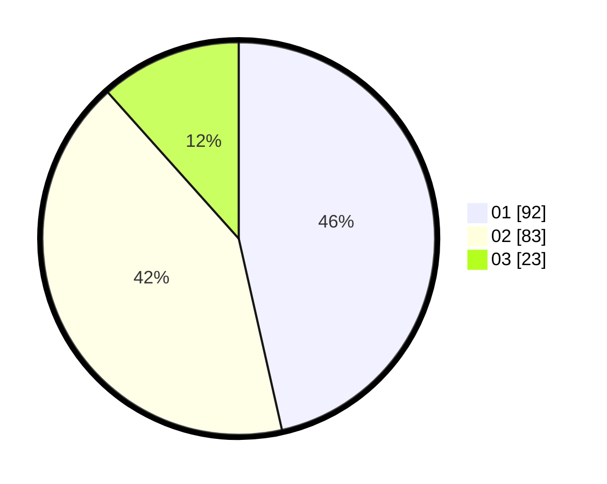

# Hasil

Hasil perolehan suara paslon dapat dilihat pada file paslon-01.txt, paslon-02.txt, dan paslon-03.txt.

Jika tidak ada, artinya data tersebut belum ada pada SIREKAP.

## Perolehan Suara

 * Paslon 01: **92**.
 * Paslon 02: **83**.
 * Paslon 03: **23**.

## Foto C Plano

https://sirekap-obj-formc.kpu.go.id/d05f/pemilu/ppwp/31/73/07/10/03/3173071003036-20240214-200054--933d2253-6738-4390-a405-c8b5030c2669.jpg

https://sirekap-obj-formc.kpu.go.id/d05f/pemilu/ppwp/31/73/07/10/03/3173071003036-20240214-200134--7c366e19-d575-462c-bbf2-9139545e7b79.jpg

https://sirekap-obj-formc.kpu.go.id/d05f/pemilu/ppwp/31/73/07/10/03/3173071003036-20240214-200216--2368d286-5d50-4b37-a057-4c768b57f846.jpg
