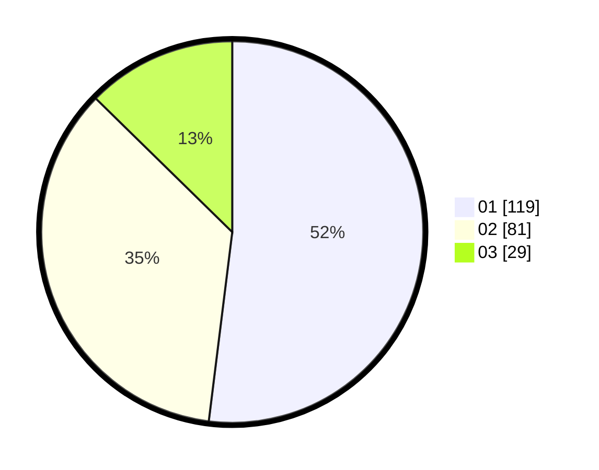

# Hasil

Hasil perolehan suara paslon dapat dilihat pada file paslon-01.txt, paslon-02.txt, dan paslon-03.txt.

Jika tidak ada, artinya data tersebut belum ada pada SIREKAP.

## Perolehan Suara

 * Paslon 01: **119**.
 * Paslon 02: **81**.
 * Paslon 03: **29**.

## Foto C Plano

https://sirekap-obj-formc.kpu.go.id/22da/pemilu/ppwp/31/73/07/10/03/3173071003038-20240214-210336--0b992ef3-5a93-4570-a843-c35d5aed2493.jpg

https://sirekap-obj-formc.kpu.go.id/22da/pemilu/ppwp/31/73/07/10/03/3173071003038-20240214-231311--9e222087-a939-47a7-ab2f-38591742d8f1.jpg

https://sirekap-obj-formc.kpu.go.id/22da/pemilu/ppwp/31/73/07/10/03/3173071003038-20240214-231354--ce9685c2-359f-4383-bc4b-376470ace213.jpg
