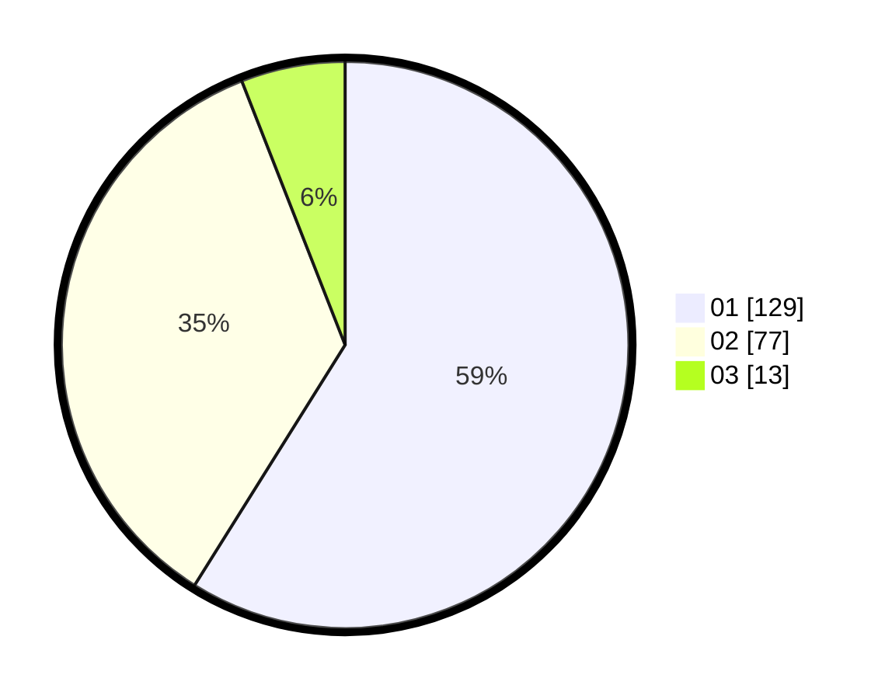

# Hasil

Hasil perolehan suara paslon dapat dilihat pada file paslon-01.txt, paslon-02.txt, dan paslon-03.txt.

Jika tidak ada, artinya data tersebut belum ada pada SIREKAP.

## Perolehan Suara

 * Paslon 01: **129**.
 * Paslon 02: **77**.
 * Paslon 03: **13**.

## Foto C Plano

https://sirekap-obj-formc.kpu.go.id/a719/pemilu/ppwp/31/73/07/10/03/3173071003044-20240214-195221--f68b1a12-83e0-4d73-83cc-bcdd662f1565.jpg

https://sirekap-obj-formc.kpu.go.id/a719/pemilu/ppwp/31/73/07/10/03/3173071003044-20240214-195450--bd9eea98-5f3f-450d-a649-530792ea51a8.jpg

https://sirekap-obj-formc.kpu.go.id/a719/pemilu/ppwp/31/73/07/10/03/3173071003044-20240214-201803--18f7d9ce-948a-46c7-b89f-74c09a6cafdb.jpg

## DATA PEMILIH TETAP

Jumlah pemilih dalam DPT: **216**.
 * L: **112**.
 * P: **104**.

## DATA PENGGUNA HAK PILIH

Jumlah pengguna hak pilih dalam DPT: **216**.
 * L: **112**.
 * P: **104**.

Jumlah pengguna hak pilih dalam DPTb: **3**.
 * L: **2**.
 * P: **1**.

Jumlah pengguna hak pilih dalam DPK: **2**.
 * L: **1**.
 * P: **1**.

Jumlah pengguna hak pilih: **221**.
 * L: **115**.
 * P: **106**.

## JUMLAH SUARA SAH DAN TIDAK SAH

JUMLAH SELURUH SUARA SAH: **219**.

JUMLAH SUARA TIDAK SAH: **2**.

JUMLAH SELURUH SUARA SAH DAN SUARA TIDAK SAH: **221**.
