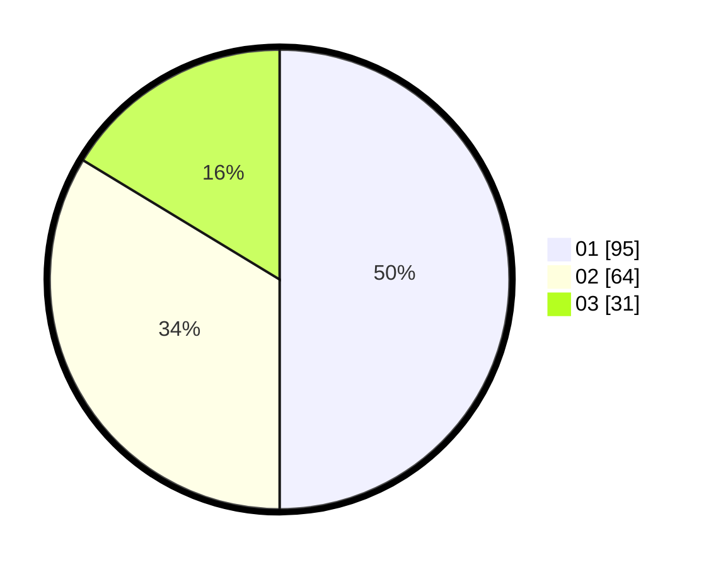

# Hasil

Hasil perolehan suara paslon dapat dilihat pada file paslon-01.txt, paslon-02.txt, dan paslon-03.txt.

Jika tidak ada, artinya data tersebut belum ada pada SIREKAP.

## Perolehan Suara

 * Paslon 01: **95**.
 * Paslon 02: **64**.
 * Paslon 03: **31**.

## Foto C Plano

https://sirekap-obj-formc.kpu.go.id/98bf/pemilu/ppwp/31/73/07/10/03/3173071003049-20240216-032313--b0a013ab-dce6-4184-95b3-b82ccdd8b492.jpg

https://sirekap-obj-formc.kpu.go.id/98bf/pemilu/ppwp/31/73/07/10/03/3173071003049-20240216-032332--03aa8a0e-7206-4d39-8557-a10112b9570e.jpg

https://sirekap-obj-formc.kpu.go.id/98bf/pemilu/ppwp/31/73/07/10/03/3173071003049-20240216-032323--15b7e16c-d5de-472b-8d32-219271441ae6.jpg

## DATA PEMILIH TETAP

Jumlah pemilih dalam DPT: **233**.
 * L: **122**.
 * P: **111**.

## DATA PENGGUNA HAK PILIH

Jumlah pengguna hak pilih dalam DPT: **179**.
 * L: **89**.
 * P: **90**.

Jumlah pengguna hak pilih dalam DPTb: **14**.
 * L: **8**.
 * P: **6**.

Jumlah pengguna hak pilih dalam DPK: **0**.
 * L: **0**.
 * P: **0**.

Jumlah pengguna hak pilih: **193**.
 * L: **97**.
 * P: **96**.

## JUMLAH SUARA SAH DAN TIDAK SAH

JUMLAH SELURUH SUARA SAH: **190**.

JUMLAH SUARA TIDAK SAH: **3**.

JUMLAH SELURUH SUARA SAH DAN SUARA TIDAK SAH: **193**.
