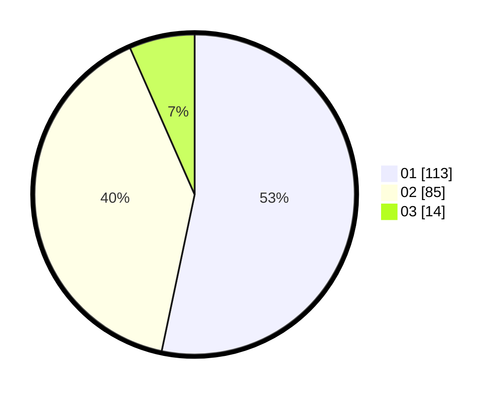

# Hasil

Hasil perolehan suara paslon dapat dilihat pada file paslon-01.txt, paslon-02.txt, dan paslon-03.txt.

Jika tidak ada, artinya data tersebut belum ada pada SIREKAP.

## Perolehan Suara

 * Paslon 01: **113**.
 * Paslon 02: **85**.
 * Paslon 03: **14**.

## Foto C Plano

https://sirekap-obj-formc.kpu.go.id/f331/pemilu/ppwp/31/73/07/10/03/3173071003051-20240214-155918--88c59231-ddc9-46e8-aee7-ad50de265413.jpg

https://sirekap-obj-formc.kpu.go.id/f331/pemilu/ppwp/31/73/07/10/03/3173071003051-20240214-231803--3d74ad43-df6f-47db-a2c6-0ea2259915c6.jpg

https://sirekap-obj-formc.kpu.go.id/f331/pemilu/ppwp/31/73/07/10/03/3173071003051-20240214-232844--37334263-5fb2-47bf-8422-7d07cbb52567.jpg

## DATA PEMILIH TETAP

Jumlah pemilih dalam DPT: **276**.
 * L: **137**.
 * P: **139**.

## DATA PENGGUNA HAK PILIH

Jumlah pengguna hak pilih dalam DPT: **207**.
 * L: **100**.
 * P: **107**.

Jumlah pengguna hak pilih dalam DPTb: **2**.
 * L: **2**.
 * P: **0**.

Jumlah pengguna hak pilih dalam DPK: **4**.
 * L: **1**.
 * P: **3**.

Jumlah pengguna hak pilih: **213**.
 * L: **103**.
 * P: **110**.

## JUMLAH SUARA SAH DAN TIDAK SAH

JUMLAH SELURUH SUARA SAH: **212**.

JUMLAH SUARA TIDAK SAH: **1**.

JUMLAH SELURUH SUARA SAH DAN SUARA TIDAK SAH: **213**.
