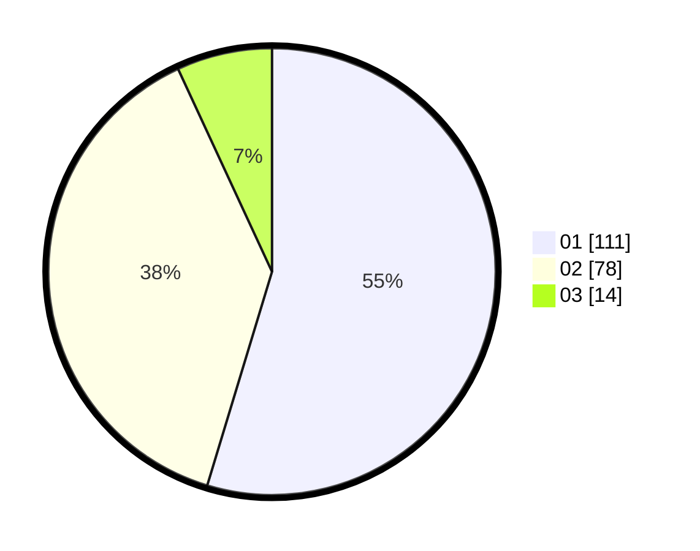

# Hasil

Hasil perolehan suara paslon dapat dilihat pada file paslon-01.txt, paslon-02.txt, dan paslon-03.txt.

Jika tidak ada, artinya data tersebut belum ada pada SIREKAP.

## Perolehan Suara

 * Paslon 01: **111**.
 * Paslon 02: **78**.
 * Paslon 03: **14**.

## Foto C Plano

https://sirekap-obj-formc.kpu.go.id/af0b/pemilu/ppwp/31/73/07/10/03/3173071003052-20240214-155707--9592bcfc-0ef2-4fc9-962e-ef3f1b778b69.jpg

https://sirekap-obj-formc.kpu.go.id/af0b/pemilu/ppwp/31/73/07/10/03/3173071003052-20240214-224147--afe16b7e-825c-4d39-837c-f71e78b69036.jpg

https://sirekap-obj-formc.kpu.go.id/af0b/pemilu/ppwp/31/73/07/10/03/3173071003052-20240214-220546--2879298e-6c4c-458c-9edb-1c2b045fdb9e.jpg
