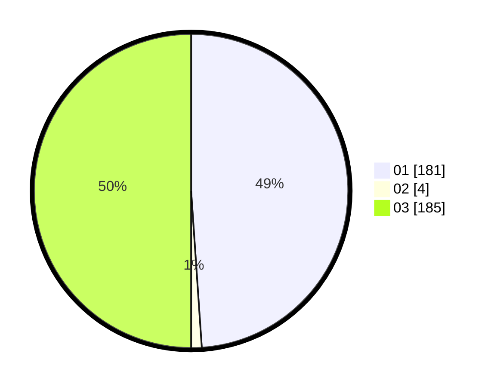

# Hasil

Hasil perolehan suara paslon dapat dilihat pada file paslon-01.txt, paslon-02.txt, dan paslon-03.txt.

Jika tidak ada, artinya data tersebut belum ada pada SIREKAP.

## Perolehan Suara

 * Paslon 01: **181**.
 * Paslon 02: **4**.
 * Paslon 03: **185**.

## Foto C Plano

https://sirekap-obj-formc.kpu.go.id/a058/pemilu/ppwp/31/73/07/10/03/3173071003053-20240215-000744--ef4f6be4-8d79-4113-a426-3ed5269bdc71.jpg

https://sirekap-obj-formc.kpu.go.id/a058/pemilu/ppwp/31/73/07/10/03/3173071003053-20240214-223212--8a976527-0e90-44d2-aa7b-d9f9735185e7.jpg

https://sirekap-obj-formc.kpu.go.id/a058/pemilu/ppwp/31/73/07/10/03/3173071003053-20240214-223324--61589907-67d6-427e-a6bc-9c88ddbebc7f.jpg
