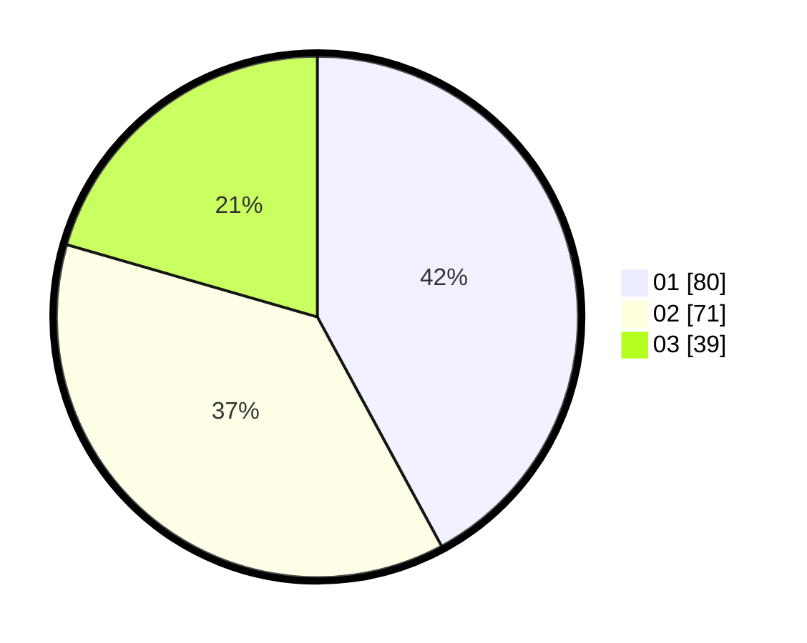

# Hasil

Hasil perolehan suara paslon dapat dilihat pada file paslon-01.txt, paslon-02.txt, dan paslon-03.txt.

Jika tidak ada, artinya data tersebut belum ada pada SIREKAP.

## Perolehan Suara

 * Paslon 01: **80**.
 * Paslon 02: **71**.
 * Paslon 03: **39**.

## Foto C Plano

https://sirekap-obj-formc.kpu.go.id/c116/pemilu/ppwp/31/73/07/10/03/3173071003054-20240214-233110--4acaada9-1139-41e0-b5c6-800cf2750f87.jpg

https://sirekap-obj-formc.kpu.go.id/c116/pemilu/ppwp/31/73/07/10/03/3173071003054-20240214-233535--37a97fa0-7575-4126-a479-ebe461e25485.jpg

https://sirekap-obj-formc.kpu.go.id/c116/pemilu/ppwp/31/73/07/10/03/3173071003054-20240214-234258--878cc1b7-7782-4bfd-bef7-f0249e0dd7b2.jpg
