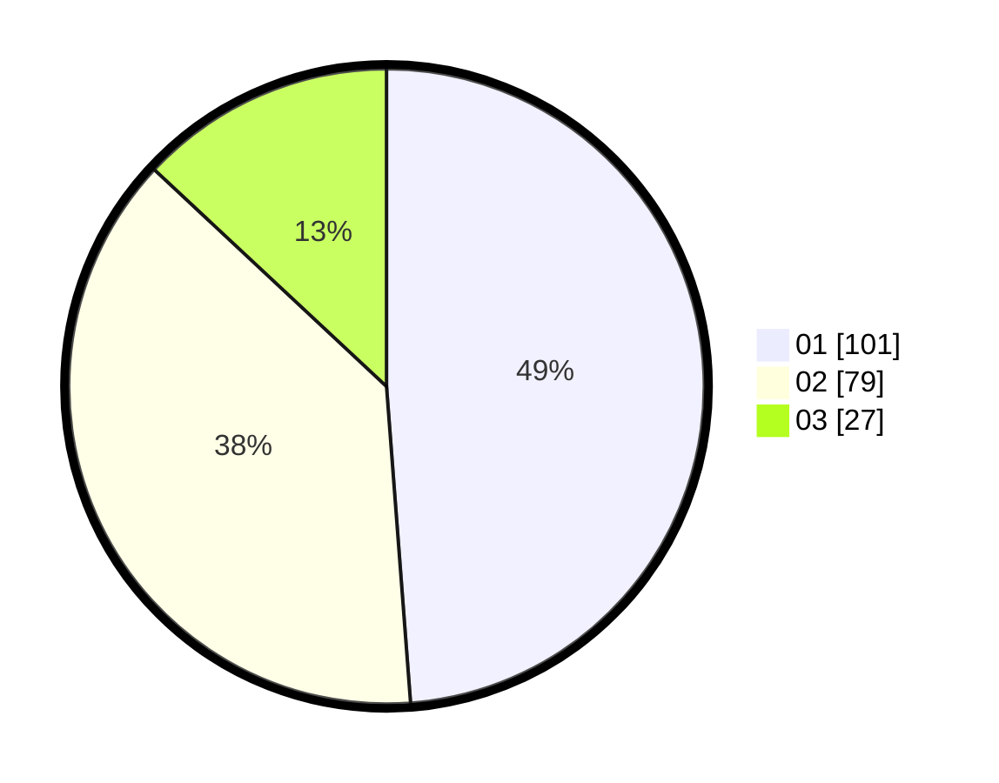

# Hasil

Hasil perolehan suara paslon dapat dilihat pada file paslon-01.txt, paslon-02.txt, dan paslon-03.txt.

Jika tidak ada, artinya data tersebut belum ada pada SIREKAP.

## Perolehan Suara

 * Paslon 01: **101**.
 * Paslon 02: **79**.
 * Paslon 03: **27**.

## Foto C Plano

https://sirekap-obj-formc.kpu.go.id/dd6a/pemilu/ppwp/31/73/07/10/03/3173071003055-20240215-003541--df27090a-65f1-4c86-b51e-3fc69ed23b53.jpg

https://sirekap-obj-formc.kpu.go.id/dd6a/pemilu/ppwp/31/73/07/10/03/3173071003055-20240215-003731--fc8ee099-6c36-4626-9d2a-721a86794afe.jpg

https://sirekap-obj-formc.kpu.go.id/dd6a/pemilu/ppwp/31/73/07/10/03/3173071003055-20240215-003941--052314d8-c077-4e77-b6b0-571d0a427d31.jpg

## DATA PEMILIH TETAP

Jumlah pemilih dalam DPT: **279**.
 * L: **142**.
 * P: **137**.

## DATA PENGGUNA HAK PILIH

Jumlah pengguna hak pilih dalam DPT: **204**.
 * L: **98**.
 * P: **106**.

Jumlah pengguna hak pilih dalam DPTb: **8**.
 * L: **2**.
 * P: **6**.

Jumlah pengguna hak pilih dalam DPK: **0**.
 * L: **0**.
 * P: **0**.

Jumlah pengguna hak pilih: **212**.
 * L: **100**.
 * P: **112**.

## JUMLAH SUARA SAH DAN TIDAK SAH

JUMLAH SELURUH SUARA SAH: **207**.

JUMLAH SUARA TIDAK SAH: **5**.

JUMLAH SELURUH SUARA SAH DAN SUARA TIDAK SAH: **212**.
