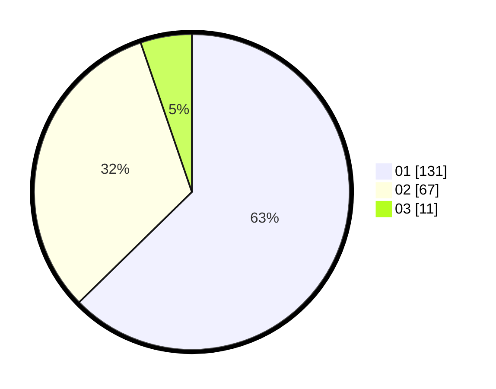

# Hasil

Hasil perolehan suara paslon dapat dilihat pada file paslon-01.txt, paslon-02.txt, dan paslon-03.txt.

Jika tidak ada, artinya data tersebut belum ada pada SIREKAP.

## Perolehan Suara

 * Paslon 01: **131**.
 * Paslon 02: **67**.
 * Paslon 03: **11**.

## Foto C Plano

https://sirekap-obj-formc.kpu.go.id/0007/pemilu/ppwp/31/73/07/10/03/3173071003059-20240215-010611--e40df9a9-c7ac-4327-8567-0820b3bb79a6.jpg

https://sirekap-obj-formc.kpu.go.id/0007/pemilu/ppwp/31/73/07/10/03/3173071003059-20240215-010713--a8aecc5a-3887-4365-90fc-dff2d2a21c40.jpg

https://sirekap-obj-formc.kpu.go.id/0007/pemilu/ppwp/31/73/07/10/03/3173071003059-20240215-010826--8071fff2-f478-4014-a0be-71132ebfc5a5.jpg
