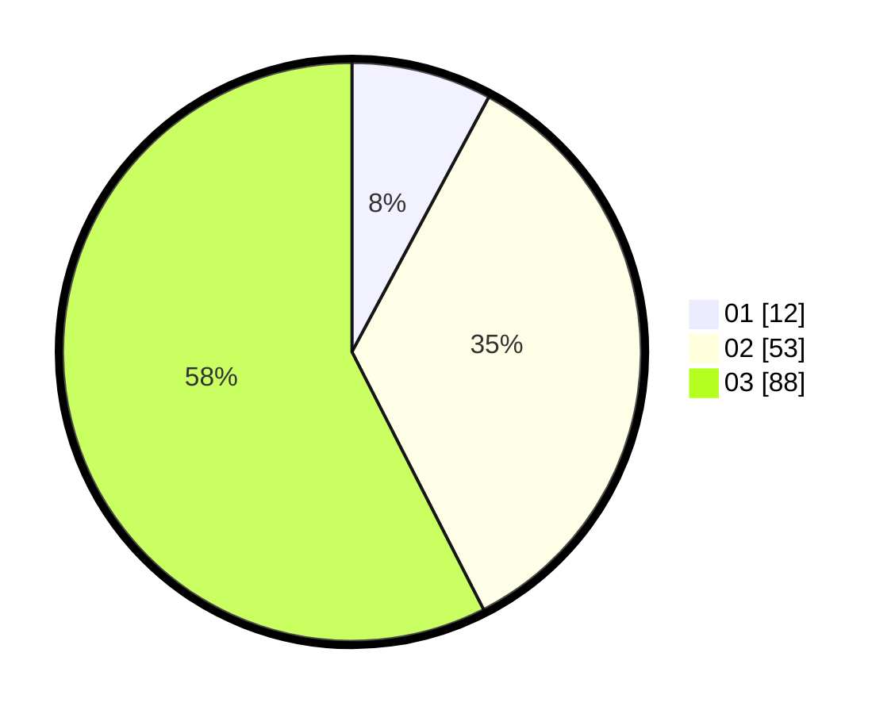

# Hasil

Hasil perolehan suara paslon dapat dilihat pada file paslon-01.txt, paslon-02.txt, dan paslon-03.txt.

Jika tidak ada, artinya data tersebut belum ada pada SIREKAP.

## Perolehan Suara

 * Paslon 01: **12**.
 * Paslon 02: **53**.
 * Paslon 03: **88**.

## Foto C Plano

https://sirekap-obj-formc.kpu.go.id/126e/pemilu/ppwp/31/73/07/10/03/3173071003060-20240215-010636--9d2e25e2-5e60-4cb4-b61b-fbf55c834a4a.jpg

https://sirekap-obj-formc.kpu.go.id/126e/pemilu/ppwp/31/73/07/10/03/3173071003060-20240215-010703--84632591-1310-416b-b3ac-db7960f7fb14.jpg

https://sirekap-obj-formc.kpu.go.id/126e/pemilu/ppwp/31/73/07/10/03/3173071003060-20240215-010724--a6f5ea83-1a72-4ca7-a2d9-6f26443d9508.jpg

## DATA PEMILIH TETAP

Jumlah pemilih dalam DPT: **231**.
 * L: **107**.
 * P: **124**.

## DATA PENGGUNA HAK PILIH

Jumlah pengguna hak pilih dalam DPT: **150**.
 * L: **70**.
 * P: **80**.

Jumlah pengguna hak pilih dalam DPTb: **1**.
 * L: **1**.
 * P: **0**.

Jumlah pengguna hak pilih dalam DPK: **2**.
 * L: **1**.
 * P: **1**.

Jumlah pengguna hak pilih: **153**.
 * L: **72**.
 * P: **81**.

## JUMLAH SUARA SAH DAN TIDAK SAH

JUMLAH SELURUH SUARA SAH: **153**.

JUMLAH SUARA TIDAK SAH: **0**.

JUMLAH SELURUH SUARA SAH DAN SUARA TIDAK SAH: **153**.
