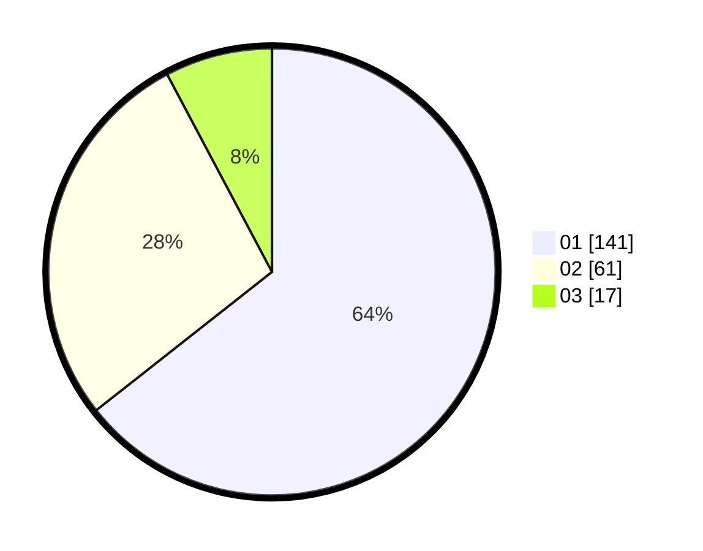

# Hasil

Hasil perolehan suara paslon dapat dilihat pada file paslon-01.txt, paslon-02.txt, dan paslon-03.txt.

Jika tidak ada, artinya data tersebut belum ada pada SIREKAP.

## Perolehan Suara

 * Paslon 01: **141**.
 * Paslon 02: **61**.
 * Paslon 03: **17**.

## Foto C Plano

https://sirekap-obj-formc.kpu.go.id/758f/pemilu/ppwp/31/73/07/10/03/3173071003063-20240214-230917--c2779d5d-e137-4be0-a010-7774a1bad2dd.jpg

https://sirekap-obj-formc.kpu.go.id/758f/pemilu/ppwp/31/73/07/10/03/3173071003063-20240214-231034--5e329dbd-9543-409d-b2f5-805138e42fc3.jpg

https://sirekap-obj-formc.kpu.go.id/758f/pemilu/ppwp/31/73/07/10/03/3173071003063-20240214-231210--375df55b-1435-4e8f-9c70-8ecbf47dd19b.jpg
