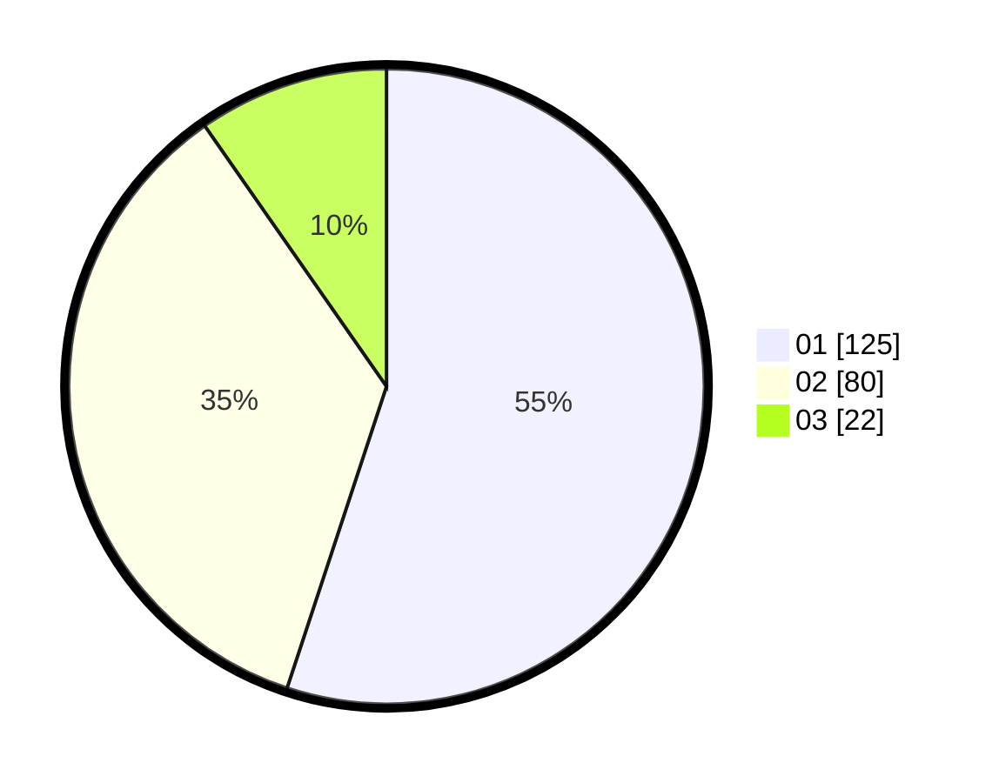

# Hasil

Hasil perolehan suara paslon dapat dilihat pada file paslon-01.txt, paslon-02.txt, dan paslon-03.txt.

Jika tidak ada, artinya data tersebut belum ada pada SIREKAP.

## Perolehan Suara

 * Paslon 01: **125**.
 * Paslon 02: **80**.
 * Paslon 03: **22**.

## Foto C Plano

https://sirekap-obj-formc.kpu.go.id/5c84/pemilu/ppwp/31/73/07/10/03/3173071003066-20240214-215808--520f2b0a-1aa7-4379-99fe-4085675eec6f.jpg

https://sirekap-obj-formc.kpu.go.id/5c84/pemilu/ppwp/31/73/07/10/03/3173071003066-20240214-215319--a73b0124-4514-4e9c-9a54-7b290be0f4ec.jpg

https://sirekap-obj-formc.kpu.go.id/5c84/pemilu/ppwp/31/73/07/10/03/3173071003066-20240214-215556--9263e202-1198-4996-b499-e560623d0b6b.jpg
