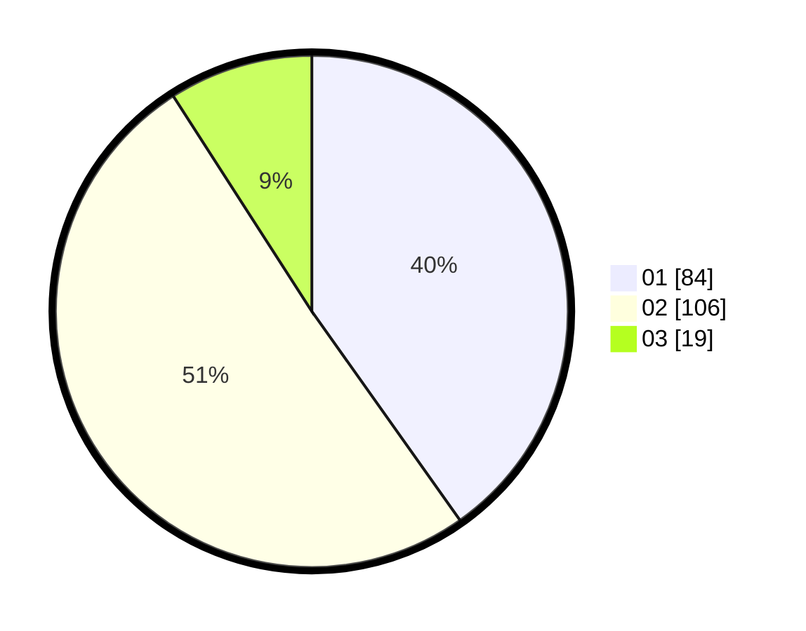

# Hasil

Hasil perolehan suara paslon dapat dilihat pada file paslon-01.txt, paslon-02.txt, dan paslon-03.txt.

Jika tidak ada, artinya data tersebut belum ada pada SIREKAP.

## Perolehan Suara

 * Paslon 01: **84**.
 * Paslon 02: **106**.
 * Paslon 03: **19**.

## Foto C Plano

https://sirekap-obj-formc.kpu.go.id/b466/pemilu/ppwp/31/73/07/10/03/3173071003069-20240214-232803--68a0d496-8f8e-41f6-b0c7-569ae49de9c6.jpg

https://sirekap-obj-formc.kpu.go.id/b466/pemilu/ppwp/31/73/07/10/03/3173071003069-20240214-233028--bd9ae03e-4b24-42c6-818e-87a82d76dee7.jpg

https://sirekap-obj-formc.kpu.go.id/b466/pemilu/ppwp/31/73/07/10/03/3173071003069-20240214-232955--6659c6fb-d15c-46f3-8b6b-2999c06b8109.jpg
