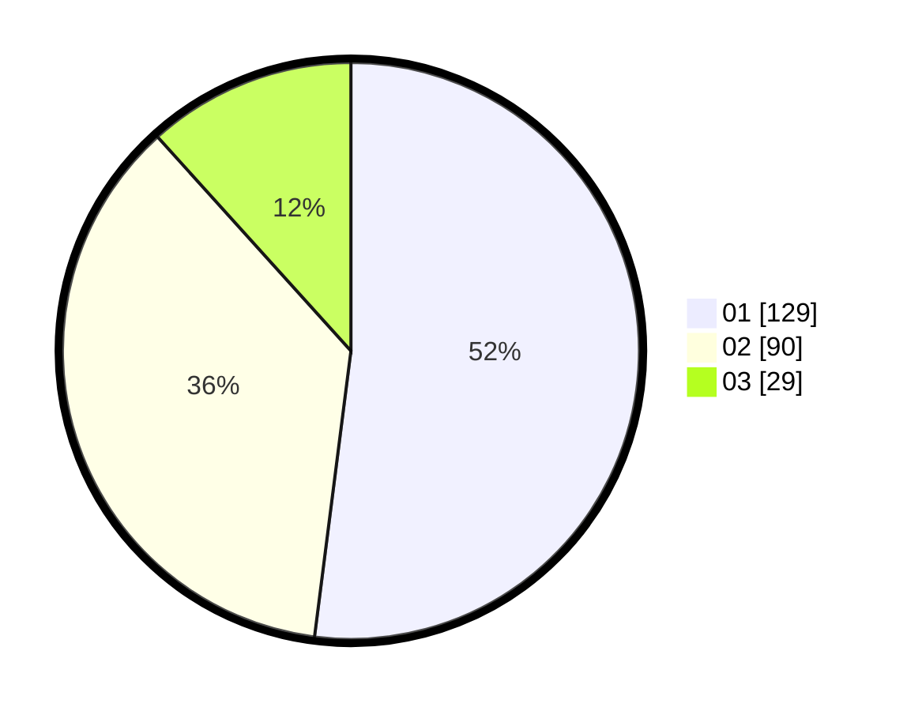

# Hasil

Hasil perolehan suara paslon dapat dilihat pada file paslon-01.txt, paslon-02.txt, dan paslon-03.txt.

Jika tidak ada, artinya data tersebut belum ada pada SIREKAP.

## Perolehan Suara

 * Paslon 01: **129**.
 * Paslon 02: **90**.
 * Paslon 03: **29**.

## Foto C Plano

https://sirekap-obj-formc.kpu.go.id/c35a/pemilu/ppwp/31/73/07/10/03/3173071003070-20240214-235138--ca9084ec-6062-437c-987d-bf1cf43fbe0b.jpg

https://sirekap-obj-formc.kpu.go.id/c35a/pemilu/ppwp/31/73/07/10/03/3173071003070-20240214-235103--07395984-5ae6-4768-bc3a-8038596fa603.jpg

https://sirekap-obj-formc.kpu.go.id/c35a/pemilu/ppwp/31/73/07/10/03/3173071003070-20240214-235226--2e230c5d-0a10-4762-b4bf-606260e032c1.jpg
