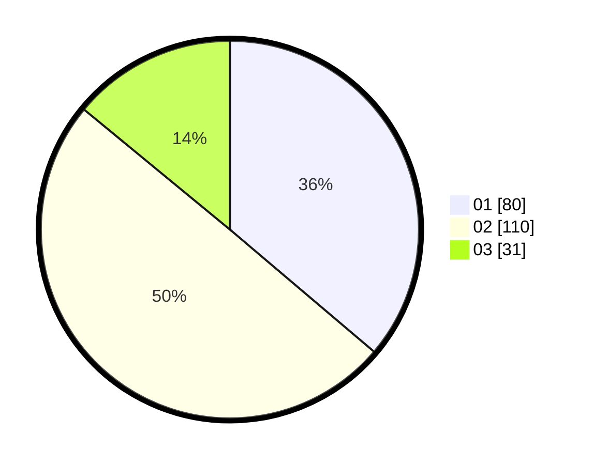

# Hasil

Hasil perolehan suara paslon dapat dilihat pada file paslon-01.txt, paslon-02.txt, dan paslon-03.txt.

Jika tidak ada, artinya data tersebut belum ada pada SIREKAP.

## Perolehan Suara

 * Paslon 01: **80**.
 * Paslon 02: **110**.
 * Paslon 03: **31**.

## Foto C Plano

https://sirekap-obj-formc.kpu.go.id/47ec/pemilu/ppwp/31/73/07/10/03/3173071003073-20240215-011712--cc0f6d7f-bc21-4ce3-babc-4bfab6f4b651.jpg

https://sirekap-obj-formc.kpu.go.id/47ec/pemilu/ppwp/31/73/07/10/03/3173071003073-20240215-011734--7f3f48dd-cb83-4cd2-a616-44894fa85ef7.jpg

https://sirekap-obj-formc.kpu.go.id/47ec/pemilu/ppwp/31/73/07/10/03/3173071003073-20240215-011723--984effbb-31f0-4a69-9a0d-4ccf1747dcc6.jpg

## DATA PEMILIH TETAP

Jumlah pemilih dalam DPT: **207**.
 * L: **104**.
 * P: **103**.

## DATA PENGGUNA HAK PILIH

Jumlah pengguna hak pilih dalam DPT: **207**.
 * L: **104**.
 * P: **103**.

Jumlah pengguna hak pilih dalam DPTb: **9**.
 * L: **0**.
 * P: **9**.

Jumlah pengguna hak pilih dalam DPK: **5**.
 * L: **2**.
 * P: **3**.

Jumlah pengguna hak pilih: **221**.
 * L: **106**.
 * P: **115**.

## JUMLAH SUARA SAH DAN TIDAK SAH

JUMLAH SELURUH SUARA SAH: **220**.

JUMLAH SUARA TIDAK SAH: **1**.

JUMLAH SELURUH SUARA SAH DAN SUARA TIDAK SAH: **221**.
