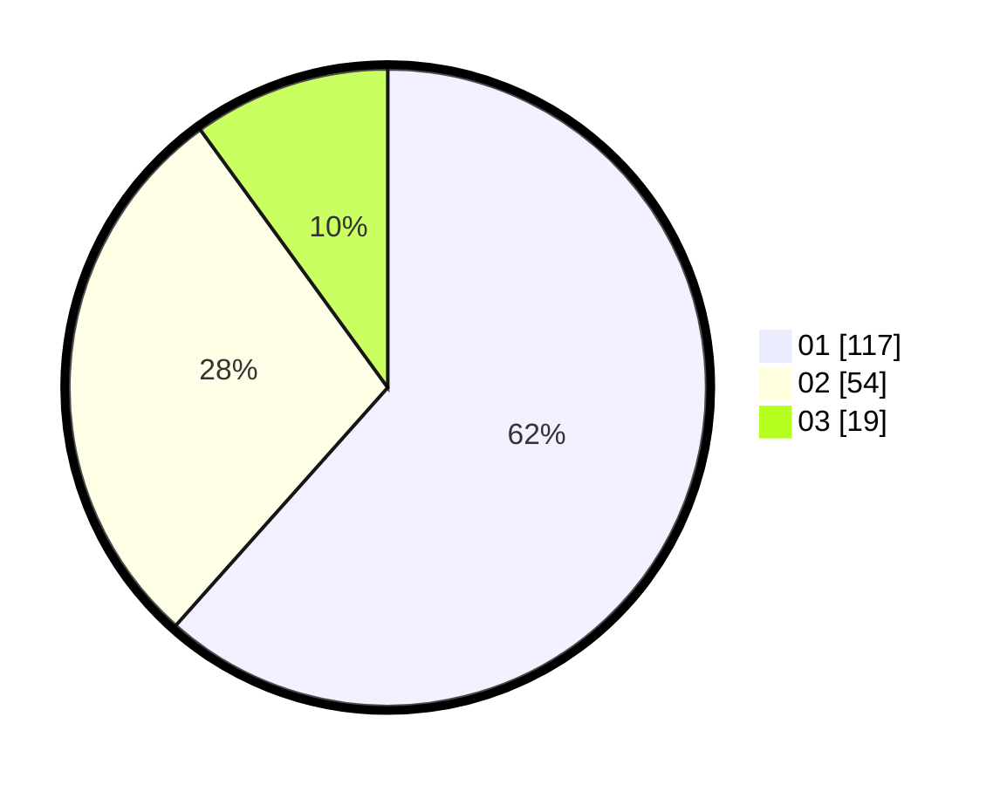

# Hasil

Hasil perolehan suara paslon dapat dilihat pada file paslon-01.txt, paslon-02.txt, dan paslon-03.txt.

Jika tidak ada, artinya data tersebut belum ada pada SIREKAP.

## Perolehan Suara

 * Paslon 01: **117**.
 * Paslon 02: **54**.
 * Paslon 03: **19**.

## Foto C Plano

https://sirekap-obj-formc.kpu.go.id/6c5b/pemilu/ppwp/31/73/07/10/03/3173071003076-20240214-224008--1f6b4b2c-a175-491d-97df-5ed8e891e93f.jpg

https://sirekap-obj-formc.kpu.go.id/6c5b/pemilu/ppwp/31/73/07/10/03/3173071003076-20240214-224125--cc656e67-1271-4228-a3b5-974b04a2a343.jpg

https://sirekap-obj-formc.kpu.go.id/6c5b/pemilu/ppwp/31/73/07/10/03/3173071003076-20240214-224217--7aa87c28-aac4-47cb-b24f-2c3834cc8307.jpg

## DATA PEMILIH TETAP

Jumlah pemilih dalam DPT: **243**.
 * L: **131**.
 * P: **112**.

## DATA PENGGUNA HAK PILIH

Jumlah pengguna hak pilih dalam DPT: **189**.
 * L: **102**.
 * P: **87**.

Jumlah pengguna hak pilih dalam DPTb: **3**.
 * L: **1**.
 * P: **2**.

Jumlah pengguna hak pilih dalam DPK: **0**.
 * L: **0**.
 * P: **0**.

Jumlah pengguna hak pilih: **192**.
 * L: **103**.
 * P: **89**.

## JUMLAH SUARA SAH DAN TIDAK SAH

JUMLAH SELURUH SUARA SAH: **190**.

JUMLAH SUARA TIDAK SAH: **2**.

JUMLAH SELURUH SUARA SAH DAN SUARA TIDAK SAH: **192**.
