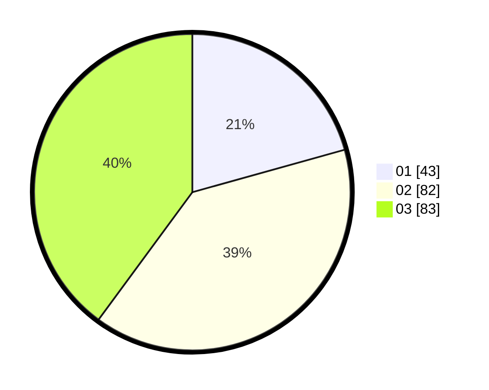

# Hasil

Hasil perolehan suara paslon dapat dilihat pada file paslon-01.txt, paslon-02.txt, dan paslon-03.txt.

Jika tidak ada, artinya data tersebut belum ada pada SIREKAP.

## Perolehan Suara

 * Paslon 01: **43**.
 * Paslon 02: **82**.
 * Paslon 03: **83**.

## Foto C Plano

https://sirekap-obj-formc.kpu.go.id/1495/pemilu/ppwp/31/73/07/10/03/3173071003078-20240214-160112--93ea33f0-3161-4277-8bd6-8d05e3263576.jpg

https://sirekap-obj-formc.kpu.go.id/1495/pemilu/ppwp/31/73/07/10/03/3173071003078-20240214-160106--d3dc4f9a-d026-4036-bb00-64207253fe59.jpg

https://sirekap-obj-formc.kpu.go.id/1495/pemilu/ppwp/31/73/07/10/03/3173071003078-20240215-004429--3aa4c7c8-3cf5-4347-9b6d-ddc73b295292.jpg
