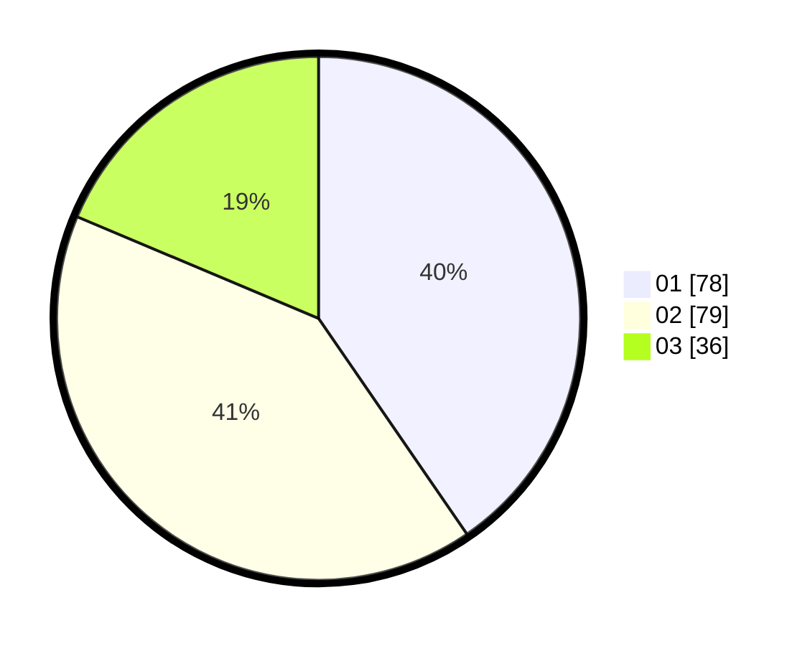

# Hasil

Hasil perolehan suara paslon dapat dilihat pada file paslon-01.txt, paslon-02.txt, dan paslon-03.txt.

Jika tidak ada, artinya data tersebut belum ada pada SIREKAP.

## Perolehan Suara

 * Paslon 01: **78**.
 * Paslon 02: **79**.
 * Paslon 03: **36**.

## Foto C Plano

https://sirekap-obj-formc.kpu.go.id/93ce/pemilu/ppwp/31/73/07/10/03/3173071003079-20240214-225909--933cd38b-6086-449d-a653-a45b54678d3f.jpg

https://sirekap-obj-formc.kpu.go.id/93ce/pemilu/ppwp/31/73/07/10/03/3173071003079-20240214-230011--43c03022-1778-42dd-8802-92984ffdb2eb.jpg

https://sirekap-obj-formc.kpu.go.id/93ce/pemilu/ppwp/31/73/07/10/03/3173071003079-20240214-230058--2b04c4d3-7c43-4391-ac5b-21813608122c.jpg
