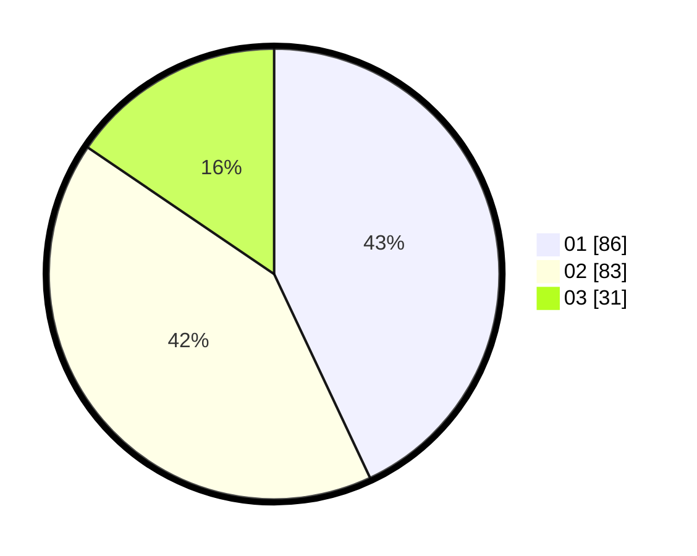

# Hasil

Hasil perolehan suara paslon dapat dilihat pada file paslon-01.txt, paslon-02.txt, dan paslon-03.txt.

Jika tidak ada, artinya data tersebut belum ada pada SIREKAP.

## Perolehan Suara

 * Paslon 01: **86**.
 * Paslon 02: **83**.
 * Paslon 03: **31**.

## Foto C Plano

https://sirekap-obj-formc.kpu.go.id/c861/pemilu/ppwp/31/73/07/10/03/3173071003080-20240215-001257--71f8c439-02b9-40ad-9455-9aeb0eced4b9.jpg

https://sirekap-obj-formc.kpu.go.id/c861/pemilu/ppwp/31/73/07/10/03/3173071003080-20240216-012056--a2511048-196d-4562-978b-38d235ed5029.jpg

https://sirekap-obj-formc.kpu.go.id/c861/pemilu/ppwp/31/73/07/10/03/3173071003080-20240215-001555--a074e2dd-62a3-4907-81e6-66d291fccffe.jpg

## DATA PEMILIH TETAP

Jumlah pemilih dalam DPT: **214**.
 * L: **121**.
 * P: **93**.

## DATA PENGGUNA HAK PILIH

Jumlah pengguna hak pilih dalam DPT: **176**.
 * L: **97**.
 * P: **79**.

Jumlah pengguna hak pilih dalam DPTb: **23**.
 * L: **6**.
 * P: **17**.

Jumlah pengguna hak pilih dalam DPK: **3**.
 * L: **1**.
 * P: **2**.

Jumlah pengguna hak pilih: **202**.
 * L: **104**.
 * P: **98**.

## JUMLAH SUARA SAH DAN TIDAK SAH

JUMLAH SELURUH SUARA SAH: **200**.

JUMLAH SUARA TIDAK SAH: **2**.

JUMLAH SELURUH SUARA SAH DAN SUARA TIDAK SAH: **202**.
