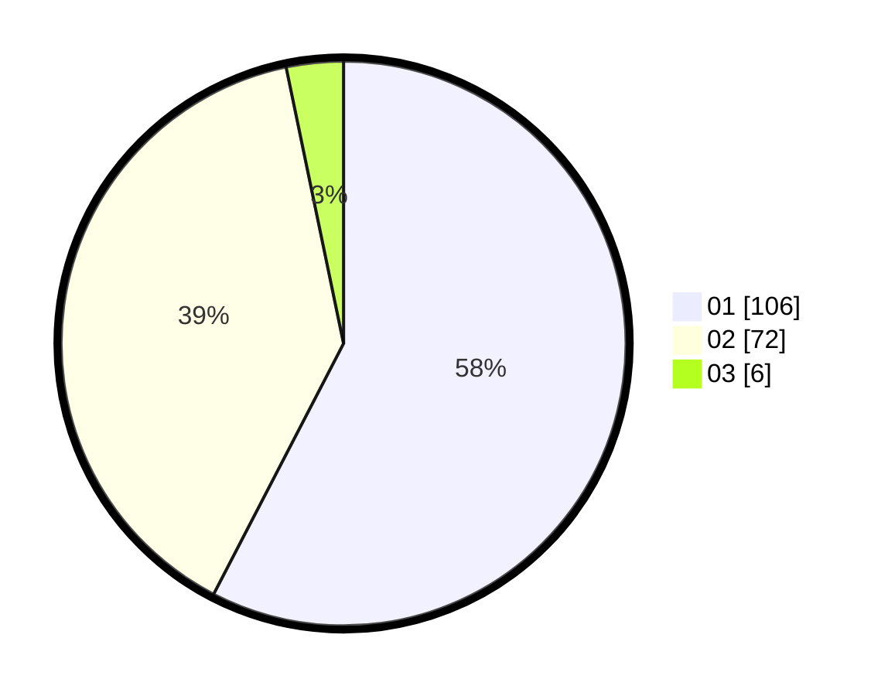

# Hasil

Hasil perolehan suara paslon dapat dilihat pada file paslon-01.txt, paslon-02.txt, dan paslon-03.txt.

Jika tidak ada, artinya data tersebut belum ada pada SIREKAP.

## Perolehan Suara

 * Paslon 01: **106**.
 * Paslon 02: **72**.
 * Paslon 03: **6**.

## Foto C Plano

https://sirekap-obj-formc.kpu.go.id/ea9b/pemilu/ppwp/31/73/07/10/03/3173071003083-20240215-004341--0379e893-7972-4736-9042-5eea678908dc.jpg

https://sirekap-obj-formc.kpu.go.id/ea9b/pemilu/ppwp/31/73/07/10/03/3173071003083-20240215-004422--ea286aaa-8f03-4d54-9d21-df222f54f73e.jpg

https://sirekap-obj-formc.kpu.go.id/ea9b/pemilu/ppwp/31/73/07/10/03/3173071003083-20240215-004459--26d7c75b-19a7-49f8-ba64-0176d1daad1f.jpg
