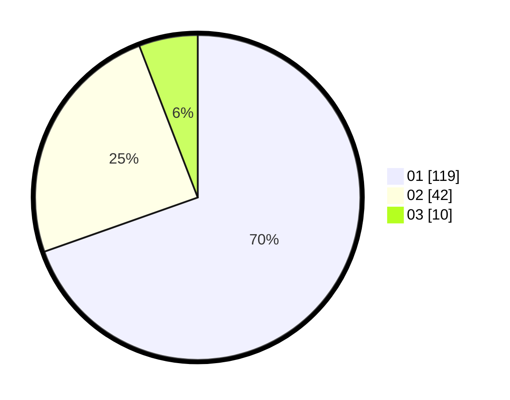

# Hasil

Hasil perolehan suara paslon dapat dilihat pada file paslon-01.txt, paslon-02.txt, dan paslon-03.txt.

Jika tidak ada, artinya data tersebut belum ada pada SIREKAP.

## Perolehan Suara

 * Paslon 01: **119**.
 * Paslon 02: **42**.
 * Paslon 03: **10**.

## Foto C Plano

https://sirekap-obj-formc.kpu.go.id/dfad/pemilu/ppwp/31/73/07/10/03/3173071003084-20240214-224045--d8d6308e-5b82-4152-accd-7c03aa7d2905.jpg

https://sirekap-obj-formc.kpu.go.id/dfad/pemilu/ppwp/31/73/07/10/03/3173071003084-20240214-224208--af6d6bb2-0a62-48d4-b459-19d50bf1e589.jpg

https://sirekap-obj-formc.kpu.go.id/dfad/pemilu/ppwp/31/73/07/10/03/3173071003084-20240214-224522--c4497a4c-c0cc-4c83-b5b5-0bcac2862129.jpg
