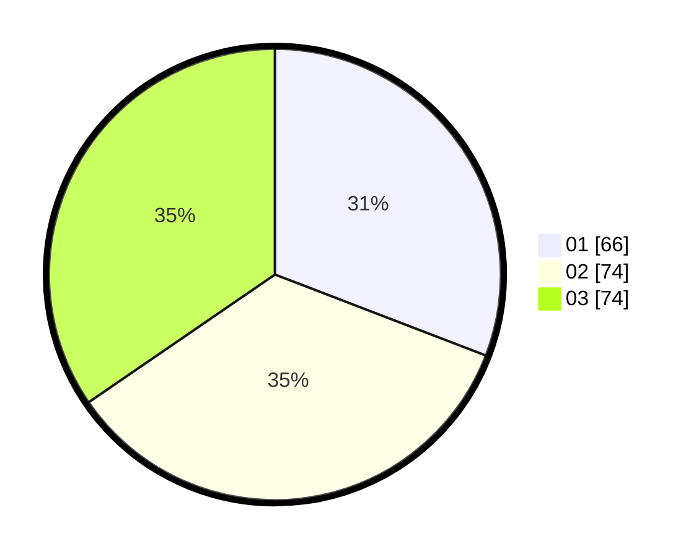

# Hasil

Hasil perolehan suara paslon dapat dilihat pada file paslon-01.txt, paslon-02.txt, dan paslon-03.txt.

Jika tidak ada, artinya data tersebut belum ada pada SIREKAP.

## Perolehan Suara

 * Paslon 01: **66**.
 * Paslon 02: **74**.
 * Paslon 03: **74**.

## Foto C Plano

https://sirekap-obj-formc.kpu.go.id/098a/pemilu/ppwp/31/73/07/10/04/3173071004004-20240214-202504--2f4abc06-517d-4ba4-b679-d66f57e92178.jpg

https://sirekap-obj-formc.kpu.go.id/098a/pemilu/ppwp/31/73/07/10/04/3173071004004-20240214-155127--35744a72-40ab-4998-b4dd-c51e5679cba5.jpg

https://sirekap-obj-formc.kpu.go.id/098a/pemilu/ppwp/31/73/07/10/04/3173071004004-20240214-202540--1876450c-7d9f-459b-a1c7-53c541bf0882.jpg

## DATA PEMILIH TETAP

Jumlah pemilih dalam DPT: **271**.
 * L: **134**.
 * P: **137**.

## DATA PENGGUNA HAK PILIH

Jumlah pengguna hak pilih dalam DPT: **205**.
 * L: **99**.
 * P: **106**.

Jumlah pengguna hak pilih dalam DPTb: **9**.
 * L: **5**.
 * P: **4**.

Jumlah pengguna hak pilih dalam DPK: **3**.
 * L: **1**.
 * P: **2**.

Jumlah pengguna hak pilih: **217**.
 * L: **105**.
 * P: **112**.

## JUMLAH SUARA SAH DAN TIDAK SAH

JUMLAH SELURUH SUARA SAH: **214**.

JUMLAH SUARA TIDAK SAH: **3**.

JUMLAH SELURUH SUARA SAH DAN SUARA TIDAK SAH: **217**.
