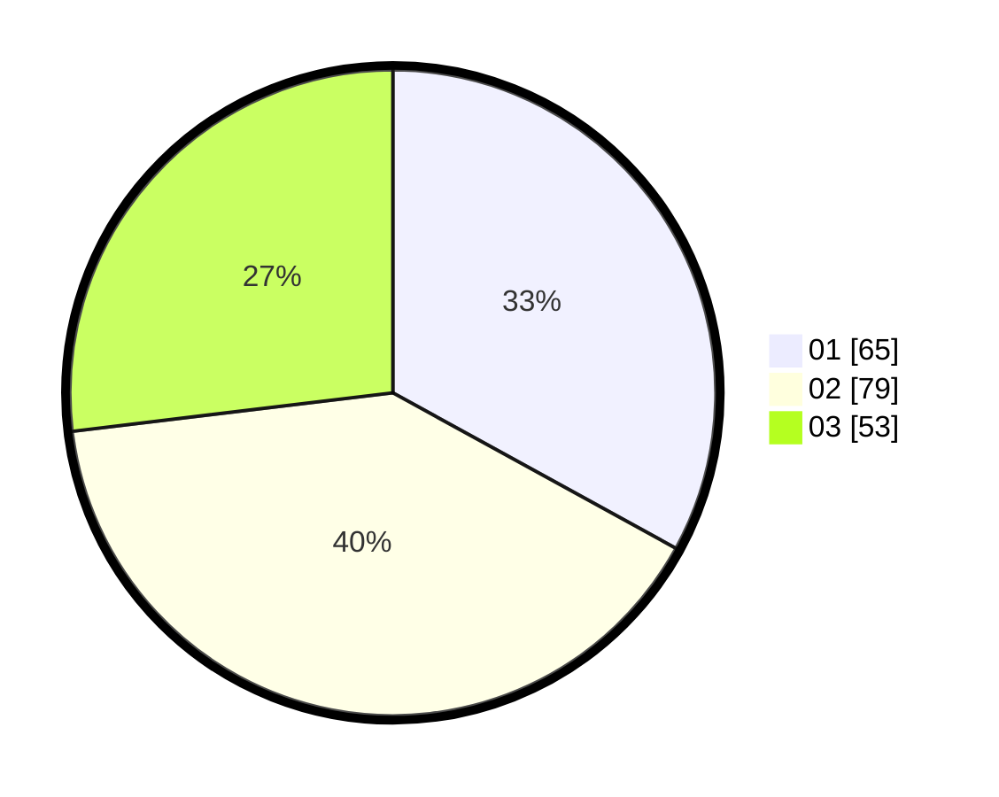

# Hasil

Hasil perolehan suara paslon dapat dilihat pada file paslon-01.txt, paslon-02.txt, dan paslon-03.txt.

Jika tidak ada, artinya data tersebut belum ada pada SIREKAP.

## Perolehan Suara

 * Paslon 01: **65**.
 * Paslon 02: **79**.
 * Paslon 03: **53**.

## Foto C Plano

https://sirekap-obj-formc.kpu.go.id/fb85/pemilu/ppwp/31/73/07/10/04/3173071004008-20240214-155040--152ad163-17cb-446e-93c3-d9ecfc982590.jpg

https://sirekap-obj-formc.kpu.go.id/fb85/pemilu/ppwp/31/73/07/10/04/3173071004008-20240214-155443--fdd74ad4-7e7d-447a-8e04-6184a52e7968.jpg
