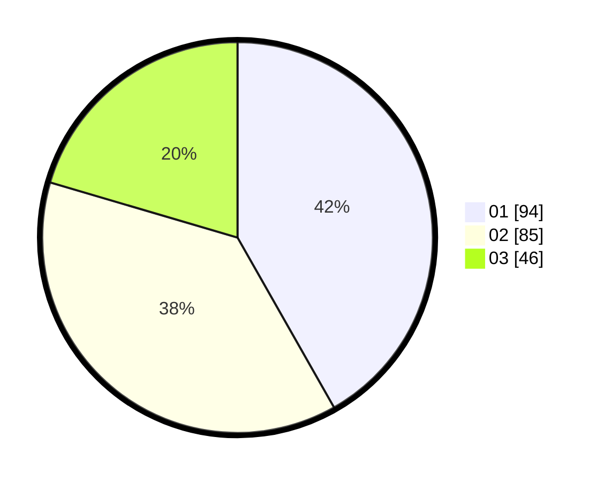

# Hasil

Hasil perolehan suara paslon dapat dilihat pada file paslon-01.txt, paslon-02.txt, dan paslon-03.txt.

Jika tidak ada, artinya data tersebut belum ada pada SIREKAP.

## Perolehan Suara

 * Paslon 01: **94**.
 * Paslon 02: **85**.
 * Paslon 03: **46**.

## Foto C Plano

https://sirekap-obj-formc.kpu.go.id/f8cf/pemilu/ppwp/31/73/07/10/04/3173071004014-20240214-231939--f49f4285-f7b6-4dbf-8cd2-672fd31ffebb.jpg

https://sirekap-obj-formc.kpu.go.id/f8cf/pemilu/ppwp/31/73/07/10/04/3173071004014-20240214-232745--e316d0ee-2c58-474f-947a-02d948172558.jpg

https://sirekap-obj-formc.kpu.go.id/f8cf/pemilu/ppwp/31/73/07/10/04/3173071004014-20240214-232859--cbc6f3da-eadf-447d-a8b8-696760cc8a03.jpg
