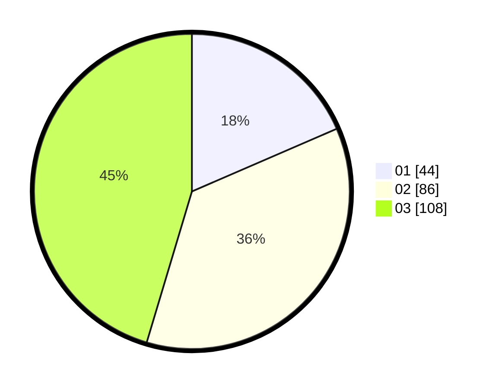

# Hasil

Hasil perolehan suara paslon dapat dilihat pada file paslon-01.txt, paslon-02.txt, dan paslon-03.txt.

Jika tidak ada, artinya data tersebut belum ada pada SIREKAP.

## Perolehan Suara

 * Paslon 01: **44**.
 * Paslon 02: **86**.
 * Paslon 03: **108**.

## Foto C Plano

https://sirekap-obj-formc.kpu.go.id/73a2/pemilu/ppwp/31/73/07/10/04/3173071004019-20240214-155835--72dd05b9-c5d4-452c-95a2-9f2afa454ff1.jpg

https://sirekap-obj-formc.kpu.go.id/73a2/pemilu/ppwp/31/73/07/10/04/3173071004019-20240214-155748--58bf6ad3-2b85-4abb-883e-01680933d43d.jpg

https://sirekap-obj-formc.kpu.go.id/73a2/pemilu/ppwp/31/73/07/10/04/3173071004019-20240214-155613--c17e0c2d-a537-4d6c-a0ee-f7f070dbe371.jpg

## DATA PEMILIH TETAP

Jumlah pemilih dalam DPT: **262**.
 * L: **123**.
 * P: **139**.

## DATA PENGGUNA HAK PILIH

Jumlah pengguna hak pilih dalam DPT: **220**.
 * L: **101**.
 * P: **119**.

Jumlah pengguna hak pilih dalam DPTb: **17**.
 * L: **9**.
 * P: **8**.

Jumlah pengguna hak pilih dalam DPK: **6**.
 * L: **2**.
 * P: **4**.

Jumlah pengguna hak pilih: **243**.
 * L: **112**.
 * P: **131**.

## JUMLAH SUARA SAH DAN TIDAK SAH

JUMLAH SELURUH SUARA SAH: **138**.

JUMLAH SUARA TIDAK SAH: **5**.

JUMLAH SELURUH SUARA SAH DAN SUARA TIDAK SAH: **243**.
