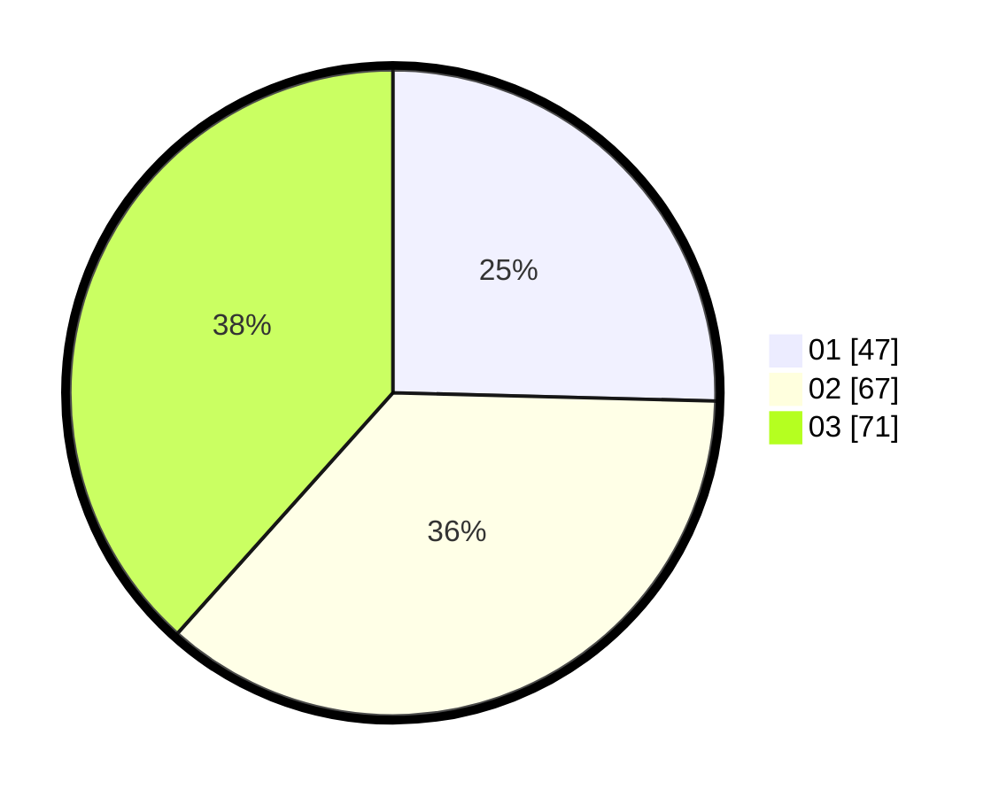

# Hasil

Hasil perolehan suara paslon dapat dilihat pada file paslon-01.txt, paslon-02.txt, dan paslon-03.txt.

Jika tidak ada, artinya data tersebut belum ada pada SIREKAP.

## Perolehan Suara

 * Paslon 01: **47**.
 * Paslon 02: **67**.
 * Paslon 03: **71**.

## Foto C Plano

https://sirekap-obj-formc.kpu.go.id/324d/pemilu/ppwp/31/73/07/10/04/3173071004020-20240215-212855--5330d629-ffe7-4524-827d-232e7be2cf44.jpg

https://sirekap-obj-formc.kpu.go.id/324d/pemilu/ppwp/31/73/07/10/04/3173071004020-20240215-212857--9f10f5be-4c0c-4531-9872-21fb9a02fb08.jpg

https://sirekap-obj-formc.kpu.go.id/324d/pemilu/ppwp/31/73/07/10/04/3173071004020-20240215-212856--511361d1-ed2b-4575-b55d-5ba900707dd5.jpg

## DATA PEMILIH TETAP

Jumlah pemilih dalam DPT: **212**.
 * L: **109**.
 * P: **103**.

## DATA PENGGUNA HAK PILIH

Jumlah pengguna hak pilih dalam DPT: **175**.
 * L: **91**.
 * P: **84**.

Jumlah pengguna hak pilih dalam DPTb: **13**.
 * L: **9**.
 * P: **4**.

Jumlah pengguna hak pilih dalam DPK: **0**.
 * L: **0**.
 * P: **0**.

Jumlah pengguna hak pilih: **188**.
 * L: **100**.
 * P: **88**.

## JUMLAH SUARA SAH DAN TIDAK SAH

JUMLAH SELURUH SUARA SAH: **185**.

JUMLAH SUARA TIDAK SAH: **3**.

JUMLAH SELURUH SUARA SAH DAN SUARA TIDAK SAH: **188**.
