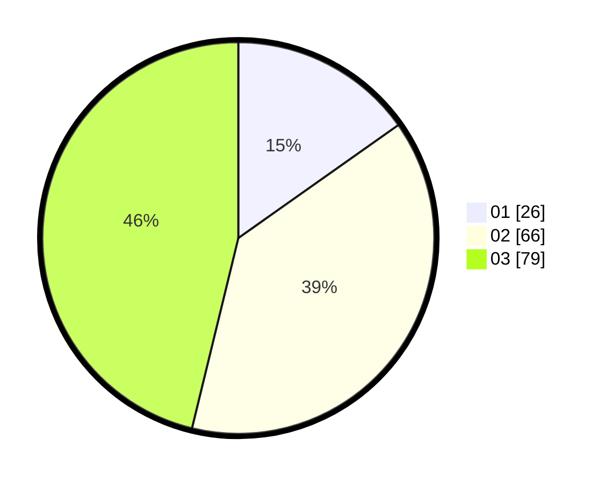

# Hasil

Hasil perolehan suara paslon dapat dilihat pada file paslon-01.txt, paslon-02.txt, dan paslon-03.txt.

Jika tidak ada, artinya data tersebut belum ada pada SIREKAP.

## Perolehan Suara

 * Paslon 01: **26**.
 * Paslon 02: **66**.
 * Paslon 03: **79**.

## Foto C Plano

https://sirekap-obj-formc.kpu.go.id/7bb0/pemilu/ppwp/31/73/07/10/04/3173071004021-20240214-195141--4da0460a-e557-454b-958b-a93fd4a5f789.jpg

https://sirekap-obj-formc.kpu.go.id/7bb0/pemilu/ppwp/31/73/07/10/04/3173071004021-20240214-195347--b9e5ea94-1f95-4c17-9022-b10e4da7a73b.jpg

https://sirekap-obj-formc.kpu.go.id/7bb0/pemilu/ppwp/31/73/07/10/04/3173071004021-20240214-221114--5a5ac102-8a4e-4293-a61c-f644544cac54.jpg
