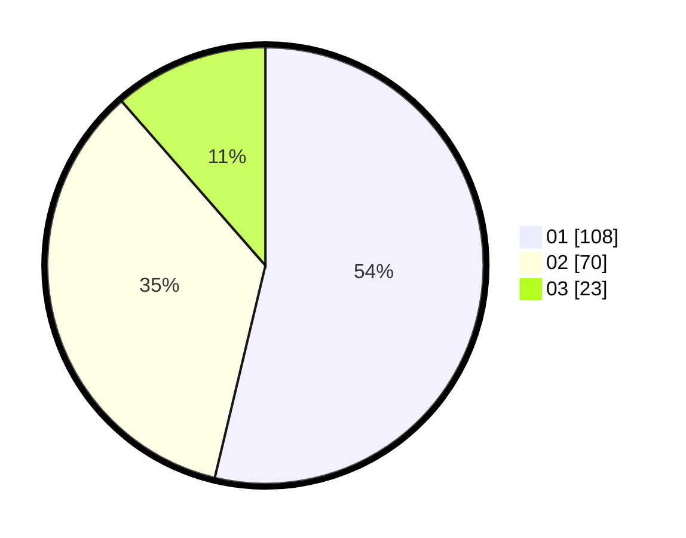

# Hasil

Hasil perolehan suara paslon dapat dilihat pada file paslon-01.txt, paslon-02.txt, dan paslon-03.txt.

Jika tidak ada, artinya data tersebut belum ada pada SIREKAP.

## Perolehan Suara

 * Paslon 01: **108**.
 * Paslon 02: **70**.
 * Paslon 03: **23**.

## Foto C Plano

https://sirekap-obj-formc.kpu.go.id/c767/pemilu/ppwp/31/73/07/10/04/3173071004022-20240216-054929--06f2e780-36a4-4c9a-be51-6cbd30f02773.jpg

https://sirekap-obj-formc.kpu.go.id/c767/pemilu/ppwp/31/73/07/10/04/3173071004022-20240216-054943--be5781c0-ac22-41ad-b696-7bd58c6e0740.jpg

https://sirekap-obj-formc.kpu.go.id/c767/pemilu/ppwp/31/73/07/10/04/3173071004022-20240216-054939--10c44e16-26eb-4a7d-8a0d-c5180397ebe8.jpg

## DATA PEMILIH TETAP

Jumlah pemilih dalam DPT: **248**.
 * L: **123**.
 * P: **125**.

## DATA PENGGUNA HAK PILIH

Jumlah pengguna hak pilih dalam DPT: **204**.
 * L: **97**.
 * P: **107**.

Jumlah pengguna hak pilih dalam DPTb: **0**.
 * L: **0**.
 * P: **0**.

Jumlah pengguna hak pilih dalam DPK: **0**.
 * L: **0**.
 * P: **0**.

Jumlah pengguna hak pilih: **204**.
 * L: **97**.
 * P: **107**.

## JUMLAH SUARA SAH DAN TIDAK SAH

JUMLAH SELURUH SUARA SAH: **201**.

JUMLAH SUARA TIDAK SAH: **3**.

JUMLAH SELURUH SUARA SAH DAN SUARA TIDAK SAH: **204**.
