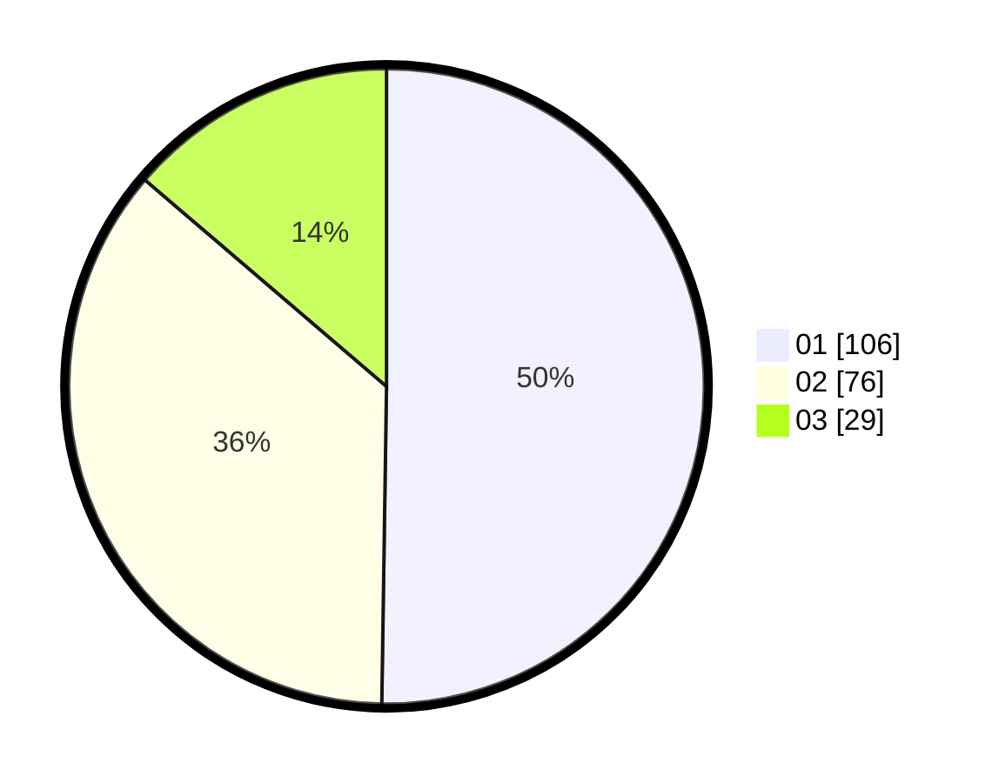

# Hasil

Hasil perolehan suara paslon dapat dilihat pada file paslon-01.txt, paslon-02.txt, dan paslon-03.txt.

Jika tidak ada, artinya data tersebut belum ada pada SIREKAP.

## Perolehan Suara

 * Paslon 01: **106**.
 * Paslon 02: **76**.
 * Paslon 03: **29**.

## Foto C Plano

https://sirekap-obj-formc.kpu.go.id/7ca7/pemilu/ppwp/31/73/07/10/04/3173071004024-20240215-071705--4ef17f86-8a21-4f28-b35f-0e2e0a1aace4.jpg

https://sirekap-obj-formc.kpu.go.id/7ca7/pemilu/ppwp/31/73/07/10/04/3173071004024-20240215-071717--16bc5786-ab69-4f69-bc50-c8b02596a8ea.jpg

https://sirekap-obj-formc.kpu.go.id/7ca7/pemilu/ppwp/31/73/07/10/04/3173071004024-20240215-071723--2363c4cb-efd5-4529-a75b-3a02371f4b75.jpg

## DATA PEMILIH TETAP

Jumlah pemilih dalam DPT: **264**.
 * L: **136**.
 * P: **128**.

## DATA PENGGUNA HAK PILIH

Jumlah pengguna hak pilih dalam DPT: **213**.
 * L: **107**.
 * P: **106**.

Jumlah pengguna hak pilih dalam DPTb: **3**.
 * L: **2**.
 * P: **1**.

Jumlah pengguna hak pilih dalam DPK: **1**.
 * L: **0**.
 * P: **1**.

Jumlah pengguna hak pilih: **217**.
 * L: **109**.
 * P: **108**.

## JUMLAH SUARA SAH DAN TIDAK SAH

JUMLAH SELURUH SUARA SAH: **211**.

JUMLAH SUARA TIDAK SAH: **6**.

JUMLAH SELURUH SUARA SAH DAN SUARA TIDAK SAH: **217**.
