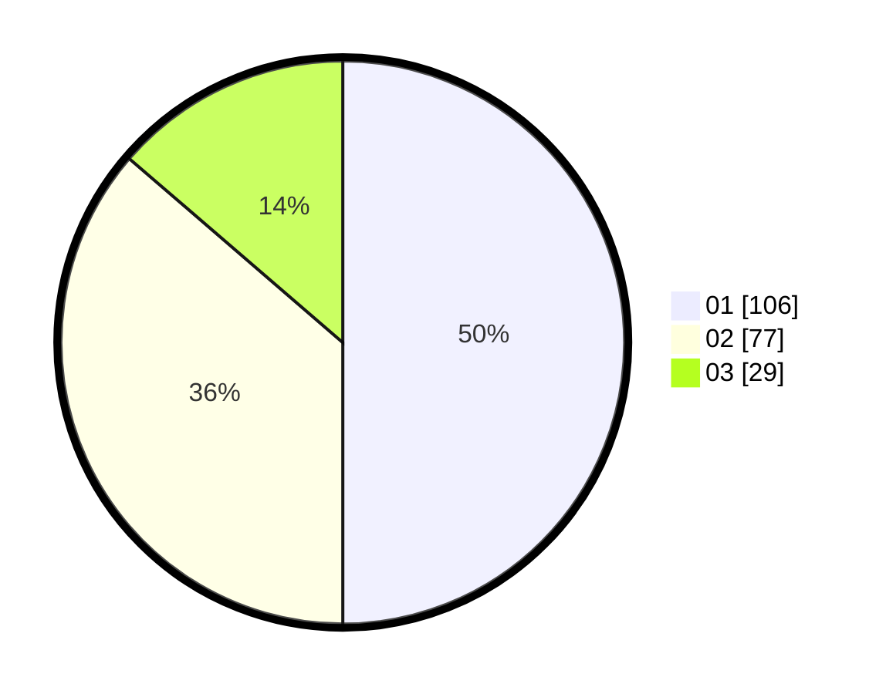

# Hasil

Hasil perolehan suara paslon dapat dilihat pada file paslon-01.txt, paslon-02.txt, dan paslon-03.txt.

Jika tidak ada, artinya data tersebut belum ada pada SIREKAP.

## Perolehan Suara

 * Paslon 01: **106**.
 * Paslon 02: **77**.
 * Paslon 03: **29**.

## Foto C Plano

https://sirekap-obj-formc.kpu.go.id/f8a4/pemilu/ppwp/31/73/07/10/04/3173071004026-20240214-214349--69ccc361-f0d1-42d7-9b9d-d3b50a71d6bd.jpg

https://sirekap-obj-formc.kpu.go.id/f8a4/pemilu/ppwp/31/73/07/10/04/3173071004026-20240214-214541--19a0575a-00e8-49af-b457-ef2f3bcb3625.jpg

https://sirekap-obj-formc.kpu.go.id/f8a4/pemilu/ppwp/31/73/07/10/04/3173071004026-20240214-214624--6705a9d3-1247-4872-aded-e18a6b351d57.jpg
