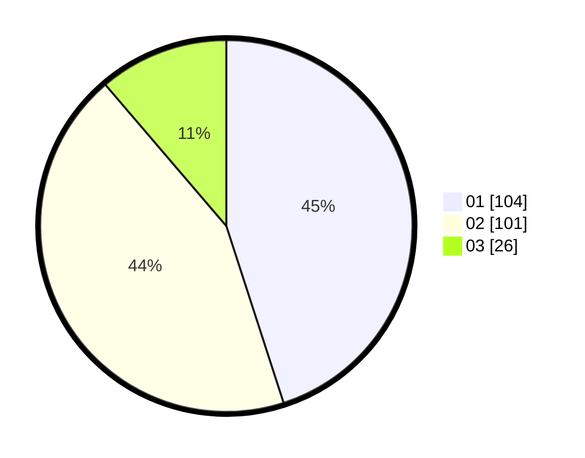

# Hasil

Hasil perolehan suara paslon dapat dilihat pada file paslon-01.txt, paslon-02.txt, dan paslon-03.txt.

Jika tidak ada, artinya data tersebut belum ada pada SIREKAP.

## Perolehan Suara

 * Paslon 01: **104**.
 * Paslon 02: **101**.
 * Paslon 03: **26**.

## Foto C Plano

https://sirekap-obj-formc.kpu.go.id/74d3/pemilu/ppwp/31/73/07/10/04/3173071004031-20240215-235448--59dcdf99-35aa-4ded-b673-f223ed044e64.jpg

https://sirekap-obj-formc.kpu.go.id/74d3/pemilu/ppwp/31/73/07/10/04/3173071004031-20240215-235449--160a5ecb-dd3b-47c4-a606-1fc83bee2236.jpg

https://sirekap-obj-formc.kpu.go.id/74d3/pemilu/ppwp/31/73/07/10/04/3173071004031-20240215-235449--da9a0d54-973a-4a35-88f1-8ace75503fc9.jpg

## DATA PEMILIH TETAP

Jumlah pemilih dalam DPT: **0**.
 * L: **0**.
 * P: **0**.

## DATA PENGGUNA HAK PILIH

Jumlah pengguna hak pilih dalam DPT: **0**.
 * L: **0**.
 * P: **0**.

Jumlah pengguna hak pilih dalam DPTb: **0**.
 * L: **0**.
 * P: **0**.

Jumlah pengguna hak pilih dalam DPK: **0**.
 * L: **0**.
 * P: **0**.

Jumlah pengguna hak pilih: **0**.
 * L: **0**.
 * P: **0**.

## JUMLAH SUARA SAH DAN TIDAK SAH

JUMLAH SELURUH SUARA SAH: **231**.

JUMLAH SUARA TIDAK SAH: **2**.

JUMLAH SELURUH SUARA SAH DAN SUARA TIDAK SAH: **233**.
