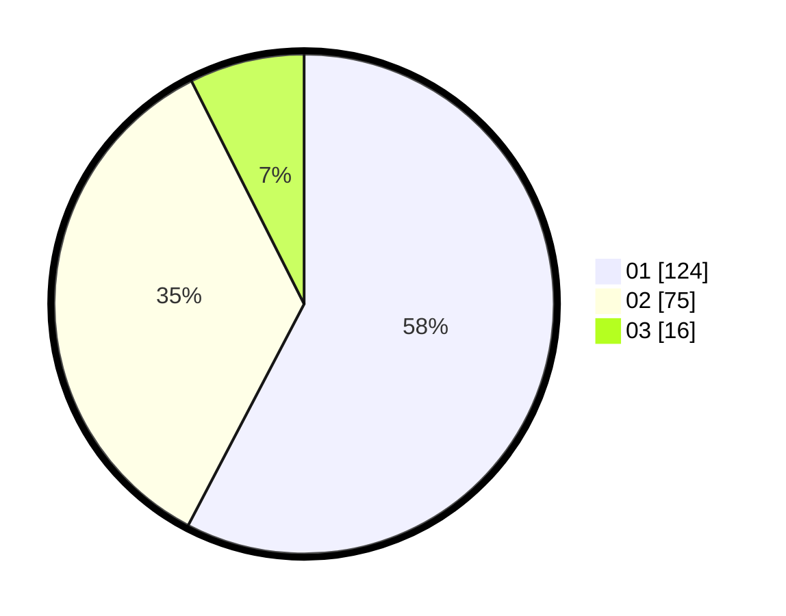

# Hasil

Hasil perolehan suara paslon dapat dilihat pada file paslon-01.txt, paslon-02.txt, dan paslon-03.txt.

Jika tidak ada, artinya data tersebut belum ada pada SIREKAP.

## Perolehan Suara

 * Paslon 01: **124**.
 * Paslon 02: **75**.
 * Paslon 03: **16**.

## Foto C Plano

https://sirekap-obj-formc.kpu.go.id/6157/pemilu/ppwp/31/73/07/10/04/3173071004034-20240214-210430--7d83fa06-cb0e-49f3-9881-350a7bbc238a.jpg

https://sirekap-obj-formc.kpu.go.id/6157/pemilu/ppwp/31/73/07/10/04/3173071004034-20240214-210605--a09649f7-de22-403f-8897-64242d65d5b6.jpg

https://sirekap-obj-formc.kpu.go.id/6157/pemilu/ppwp/31/73/07/10/04/3173071004034-20240214-210708--f72d6b0f-2d1c-42d0-97bf-47b462492fd5.jpg

## DATA PEMILIH TETAP

Jumlah pemilih dalam DPT: **266**.
 * L: **132**.
 * P: **134**.

## DATA PENGGUNA HAK PILIH

Jumlah pengguna hak pilih dalam DPT: **212**.
 * L: **99**.
 * P: **113**.

Jumlah pengguna hak pilih dalam DPTb: **0**.
 * L: **0**.
 * P: **0**.

Jumlah pengguna hak pilih dalam DPK: **3**.
 * L: **1**.
 * P: **2**.

Jumlah pengguna hak pilih: **215**.
 * L: **100**.
 * P: **115**.

## JUMLAH SUARA SAH DAN TIDAK SAH

JUMLAH SELURUH SUARA SAH: **215**.

JUMLAH SUARA TIDAK SAH: **0**.

JUMLAH SELURUH SUARA SAH DAN SUARA TIDAK SAH: **215**.
