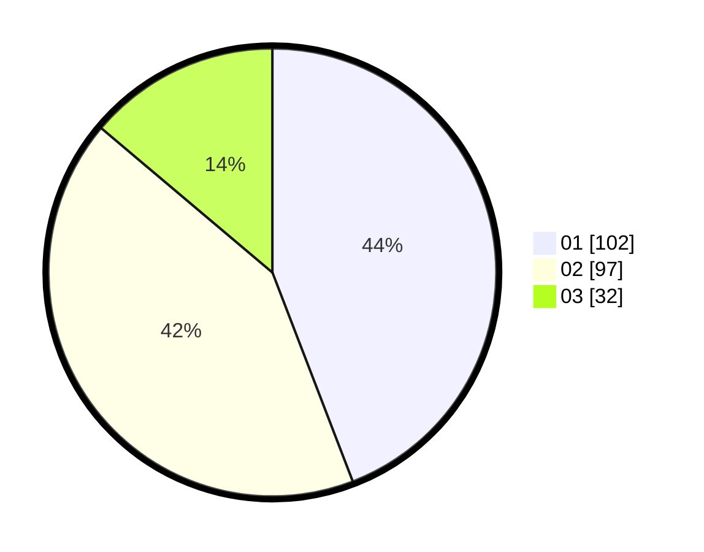

# Hasil

Hasil perolehan suara paslon dapat dilihat pada file paslon-01.txt, paslon-02.txt, dan paslon-03.txt.

Jika tidak ada, artinya data tersebut belum ada pada SIREKAP.

## Perolehan Suara

 * Paslon 01: **102**.
 * Paslon 02: **97**.
 * Paslon 03: **32**.

## Foto C Plano

https://sirekap-obj-formc.kpu.go.id/b1ad/pemilu/ppwp/31/73/07/10/04/3173071004037-20240214-192529--5a105080-d022-4fad-8aae-b61db6eb6b23.jpg

https://sirekap-obj-formc.kpu.go.id/b1ad/pemilu/ppwp/31/73/07/10/04/3173071004037-20240214-192537--6cb045c9-3612-4a02-ad59-f807e0534470.jpg

https://sirekap-obj-formc.kpu.go.id/b1ad/pemilu/ppwp/31/73/07/10/04/3173071004037-20240214-192546--90f3f3f0-f1f8-4dce-a6ce-ca7d9beb2b02.jpg

## DATA PEMILIH TETAP

Jumlah pemilih dalam DPT: **289**.
 * L: **142**.
 * P: **147**.

## DATA PENGGUNA HAK PILIH

Jumlah pengguna hak pilih dalam DPT: **231**.
 * L: **104**.
 * P: **127**.

Jumlah pengguna hak pilih dalam DPTb: **0**.
 * L: **0**.
 * P: **0**.

Jumlah pengguna hak pilih dalam DPK: **3**.
 * L: **3**.
 * P: **0**.

Jumlah pengguna hak pilih: **234**.
 * L: **107**.
 * P: **127**.

## JUMLAH SUARA SAH DAN TIDAK SAH

JUMLAH SELURUH SUARA SAH: **231**.

JUMLAH SUARA TIDAK SAH: **3**.

JUMLAH SELURUH SUARA SAH DAN SUARA TIDAK SAH: **234**.
