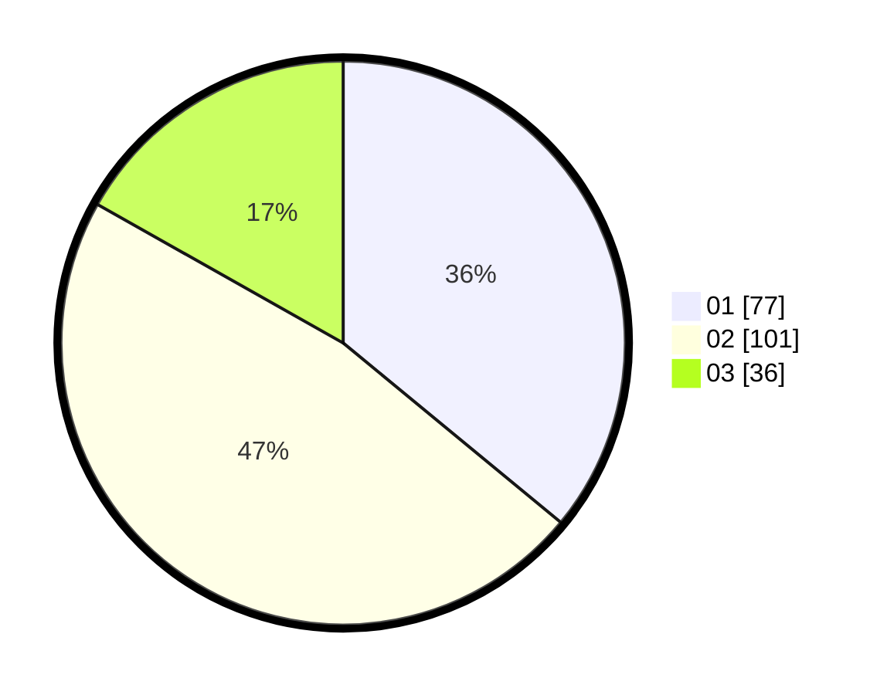

# Hasil

Hasil perolehan suara paslon dapat dilihat pada file paslon-01.txt, paslon-02.txt, dan paslon-03.txt.

Jika tidak ada, artinya data tersebut belum ada pada SIREKAP.

## Perolehan Suara

 * Paslon 01: **77**.
 * Paslon 02: **101**.
 * Paslon 03: **36**.

## Foto C Plano

https://sirekap-obj-formc.kpu.go.id/6f62/pemilu/ppwp/31/73/07/10/04/3173071004039-20240214-213349--e1d4d6c1-773c-4f95-897f-94e2c493ebb0.jpg

https://sirekap-obj-formc.kpu.go.id/6f62/pemilu/ppwp/31/73/07/10/04/3173071004039-20240214-214010--4f5578b1-6aee-451b-99eb-621de519eed1.jpg

https://sirekap-obj-formc.kpu.go.id/6f62/pemilu/ppwp/31/73/07/10/04/3173071004039-20240214-214323--7ebbd0d6-de1f-4bb9-b43e-60bd4aa69091.jpg
