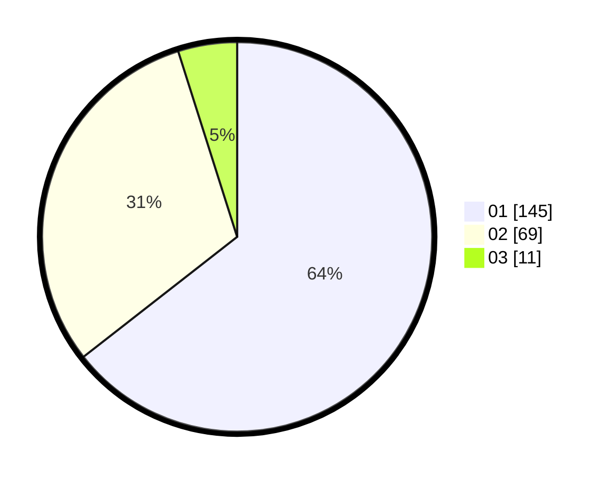

# Hasil

Hasil perolehan suara paslon dapat dilihat pada file paslon-01.txt, paslon-02.txt, dan paslon-03.txt.

Jika tidak ada, artinya data tersebut belum ada pada SIREKAP.

## Perolehan Suara

 * Paslon 01: **145**.
 * Paslon 02: **69**.
 * Paslon 03: **11**.

## Foto C Plano

https://sirekap-obj-formc.kpu.go.id/87ee/pemilu/ppwp/31/73/07/10/04/3173071004042-20240214-215531--660c0a61-af81-4e5a-99e7-8fa32d52bff0.jpg

https://sirekap-obj-formc.kpu.go.id/87ee/pemilu/ppwp/31/73/07/10/04/3173071004042-20240214-215605--06ea8820-3219-41a0-b315-ac9077bd7fbb.jpg

https://sirekap-obj-formc.kpu.go.id/87ee/pemilu/ppwp/31/73/07/10/04/3173071004042-20240214-215730--5435c871-d2c7-4bc9-84b0-d8fefc2804a3.jpg
