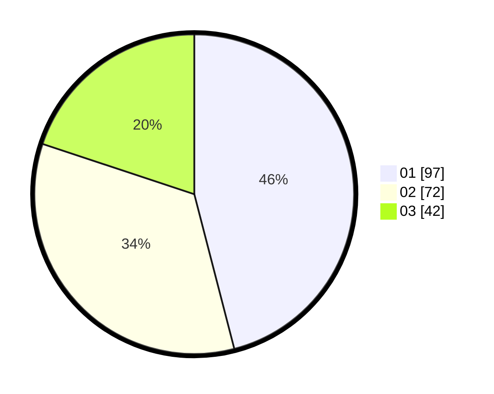

# Hasil

Hasil perolehan suara paslon dapat dilihat pada file paslon-01.txt, paslon-02.txt, dan paslon-03.txt.

Jika tidak ada, artinya data tersebut belum ada pada SIREKAP.

## Perolehan Suara

 * Paslon 01: **97**.
 * Paslon 02: **72**.
 * Paslon 03: **42**.

## Foto C Plano

https://sirekap-obj-formc.kpu.go.id/fcd9/pemilu/ppwp/31/73/07/10/04/3173071004050-20240215-005925--84c3a34e-66d0-4ed0-a9f6-39f8e64a8243.jpg

https://sirekap-obj-formc.kpu.go.id/fcd9/pemilu/ppwp/31/73/07/10/04/3173071004050-20240215-010028--2cd0cca0-0858-45d5-a8d5-0b201e94acdc.jpg

https://sirekap-obj-formc.kpu.go.id/fcd9/pemilu/ppwp/31/73/07/10/04/3173071004050-20240215-010121--4b61a3b0-a0cf-4d66-90c9-a6f7c2b701a4.jpg
