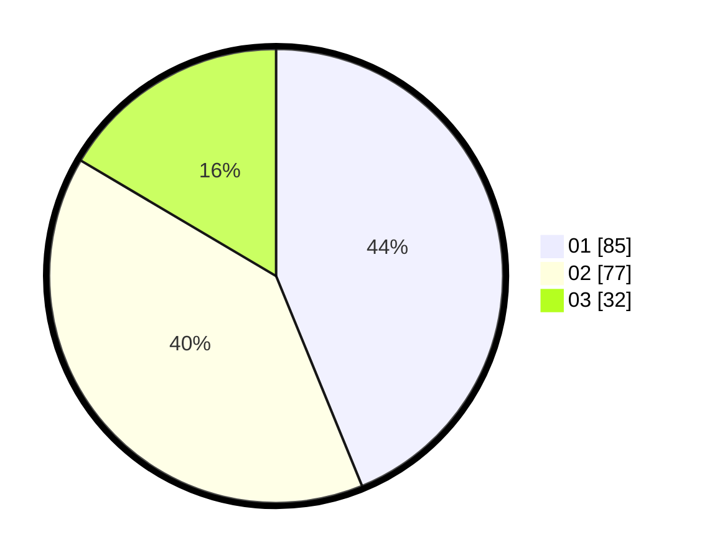

# Hasil

Hasil perolehan suara paslon dapat dilihat pada file paslon-01.txt, paslon-02.txt, dan paslon-03.txt.

Jika tidak ada, artinya data tersebut belum ada pada SIREKAP.

## Perolehan Suara

 * Paslon 01: **85**.
 * Paslon 02: **77**.
 * Paslon 03: **32**.

## Foto C Plano

https://sirekap-obj-formc.kpu.go.id/99f1/pemilu/ppwp/31/73/07/10/04/3173071004053-20240214-233955--a0212a95-2b23-441b-8a25-0a00f72fb09d.jpg

https://sirekap-obj-formc.kpu.go.id/99f1/pemilu/ppwp/31/73/07/10/04/3173071004053-20240214-225701--e7363c7a-3e55-4e60-bfb9-85fd61fe2afb.jpg

https://sirekap-obj-formc.kpu.go.id/99f1/pemilu/ppwp/31/73/07/10/04/3173071004053-20240214-225817--6917da3d-5cb5-4c05-8b24-c2dd7e4b91c6.jpg
