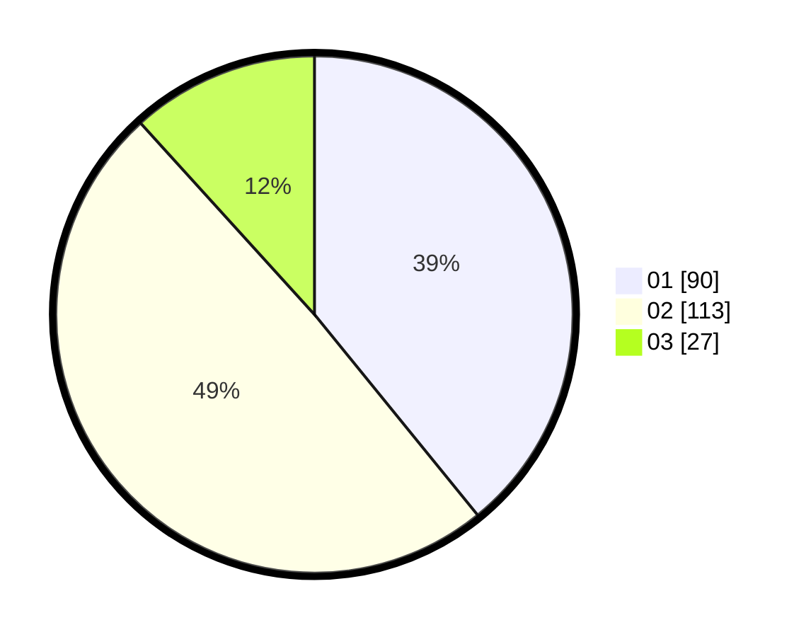

# Hasil

Hasil perolehan suara paslon dapat dilihat pada file paslon-01.txt, paslon-02.txt, dan paslon-03.txt.

Jika tidak ada, artinya data tersebut belum ada pada SIREKAP.

## Perolehan Suara

 * Paslon 01: **90**.
 * Paslon 02: **113**.
 * Paslon 03: **27**.

## Foto C Plano

https://sirekap-obj-formc.kpu.go.id/b327/pemilu/ppwp/31/73/07/10/04/3173071004054-20240214-190256--b91f8d54-421c-45bd-803e-16ee45ba5897.jpg

https://sirekap-obj-formc.kpu.go.id/b327/pemilu/ppwp/31/73/07/10/04/3173071004054-20240214-190355--c56c6b66-698d-4e54-b566-bd26c22cda17.jpg

https://sirekap-obj-formc.kpu.go.id/b327/pemilu/ppwp/31/73/07/10/04/3173071004054-20240214-190757--419f3983-1aa1-4423-8b7e-9ca23896cd56.jpg
