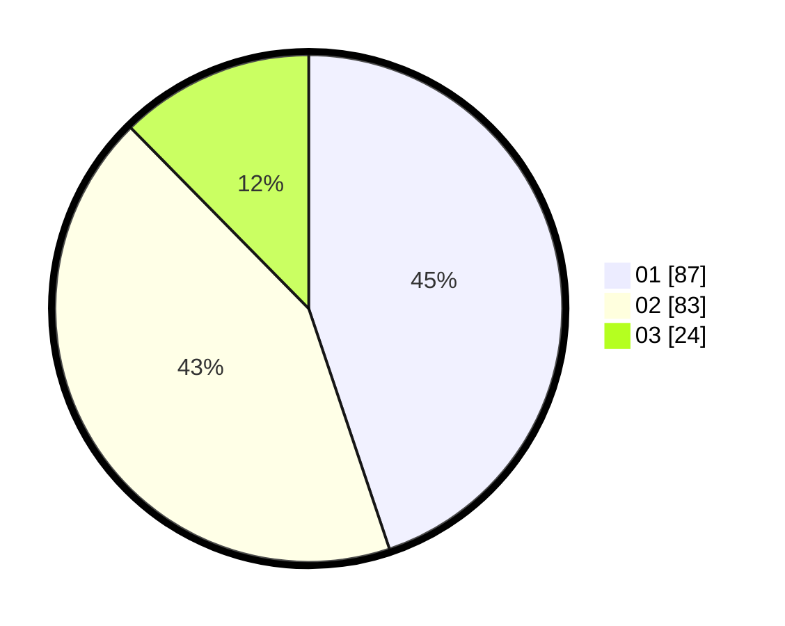

# Hasil

Hasil perolehan suara paslon dapat dilihat pada file paslon-01.txt, paslon-02.txt, dan paslon-03.txt.

Jika tidak ada, artinya data tersebut belum ada pada SIREKAP.

## Perolehan Suara

 * Paslon 01: **87**.
 * Paslon 02: **83**.
 * Paslon 03: **24**.

## Foto C Plano

https://sirekap-obj-formc.kpu.go.id/8d62/pemilu/ppwp/31/73/07/10/04/3173071004057-20240215-022801--4a1b6c29-9fa4-4cd8-809c-a1c44e6b2c3d.jpg

https://sirekap-obj-formc.kpu.go.id/8d62/pemilu/ppwp/31/73/07/10/04/3173071004057-20240215-023355--4a3ca083-3906-4d65-888a-29994d79e928.jpg

https://sirekap-obj-formc.kpu.go.id/8d62/pemilu/ppwp/31/73/07/10/04/3173071004057-20240215-023016--bfe39114-7d74-4b9b-a7ed-c6c69f2f8133.jpg
