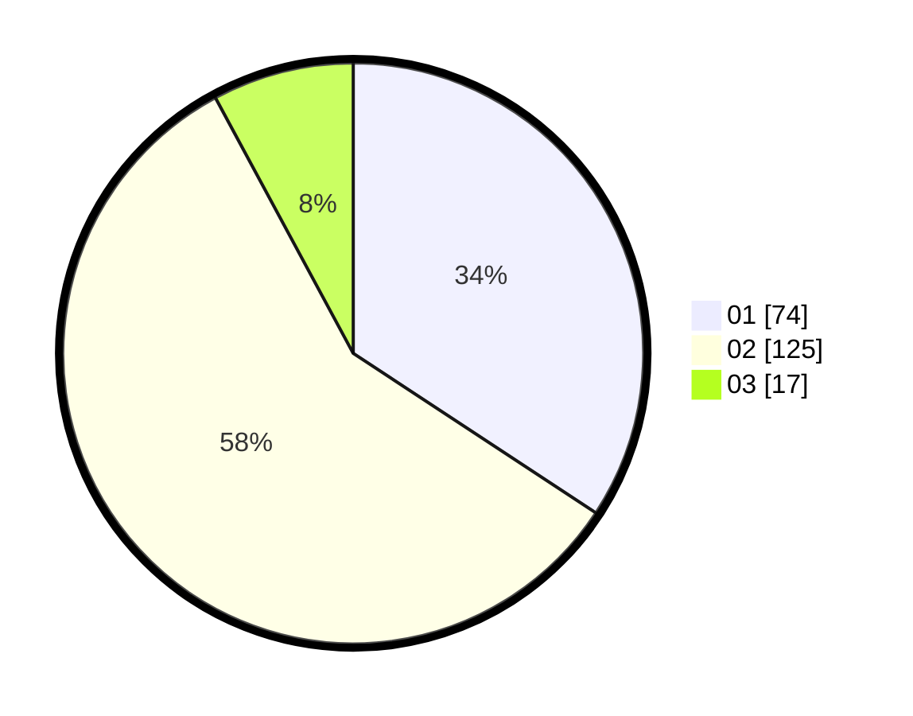

# Hasil

Hasil perolehan suara paslon dapat dilihat pada file paslon-01.txt, paslon-02.txt, dan paslon-03.txt.

Jika tidak ada, artinya data tersebut belum ada pada SIREKAP.

## Perolehan Suara

 * Paslon 01: **74**.
 * Paslon 02: **125**.
 * Paslon 03: **17**.

## Foto C Plano

https://sirekap-obj-formc.kpu.go.id/151c/pemilu/ppwp/31/73/07/10/04/3173071004059-20240216-134106--f86bdc49-aae5-4bd9-af83-8cb7bbf76393.jpg

https://sirekap-obj-formc.kpu.go.id/151c/pemilu/ppwp/31/73/07/10/04/3173071004059-20240216-134107--fbaace20-364d-488e-a8b7-1e1c6be837df.jpg

https://sirekap-obj-formc.kpu.go.id/151c/pemilu/ppwp/31/73/07/10/04/3173071004059-20240216-134106--5e1b66de-67c9-468b-a116-e3ac584cfeac.jpg

## DATA PEMILIH TETAP

Jumlah pemilih dalam DPT: **263**.
 * L: **135**.
 * P: **128**.

## DATA PENGGUNA HAK PILIH

Jumlah pengguna hak pilih dalam DPT: **217**.
 * L: **114**.
 * P: **103**.

Jumlah pengguna hak pilih dalam DPTb: **0**.
 * L: **0**.
 * P: **0**.

Jumlah pengguna hak pilih dalam DPK: **1**.
 * L: **0**.
 * P: **1**.

Jumlah pengguna hak pilih: **218**.
 * L: **114**.
 * P: **104**.

## JUMLAH SUARA SAH DAN TIDAK SAH

JUMLAH SELURUH SUARA SAH: **216**.

JUMLAH SUARA TIDAK SAH: **2**.

JUMLAH SELURUH SUARA SAH DAN SUARA TIDAK SAH: **218**.
