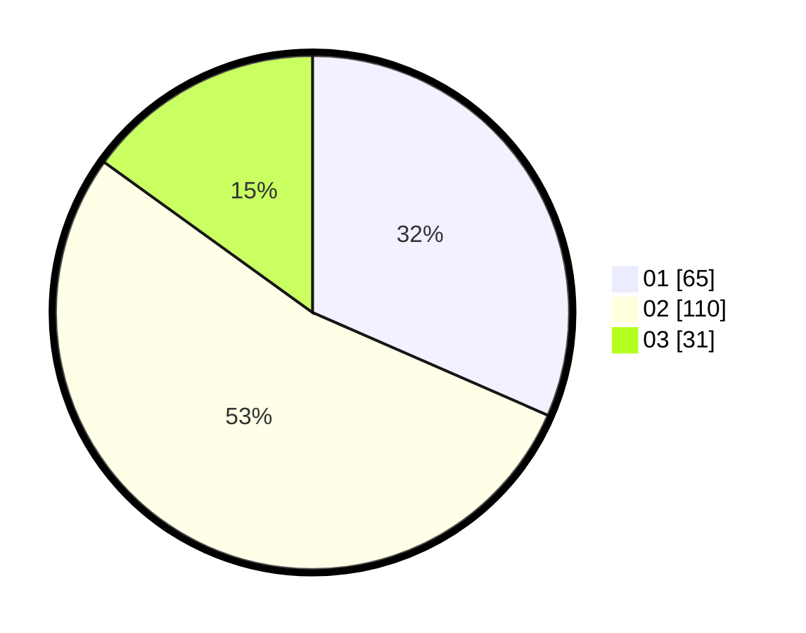

# Hasil

Hasil perolehan suara paslon dapat dilihat pada file paslon-01.txt, paslon-02.txt, dan paslon-03.txt.

Jika tidak ada, artinya data tersebut belum ada pada SIREKAP.

## Perolehan Suara

 * Paslon 01: **65**.
 * Paslon 02: **110**.
 * Paslon 03: **31**.

## Foto C Plano

https://sirekap-obj-formc.kpu.go.id/b7c3/pemilu/ppwp/31/73/07/10/04/3173071004060-20240214-203636--d498e88d-9eee-4abb-b530-1b78c54f95f2.jpg

https://sirekap-obj-formc.kpu.go.id/b7c3/pemilu/ppwp/31/73/07/10/04/3173071004060-20240215-195930--4c02d60c-d598-4756-a9b3-75d4bc27da9a.jpg

https://sirekap-obj-formc.kpu.go.id/b7c3/pemilu/ppwp/31/73/07/10/04/3173071004060-20240214-205904--0452eb3f-2b44-48e2-a18d-10f27e40600e.jpg

## DATA PEMILIH TETAP

Jumlah pemilih dalam DPT: **262**.
 * L: **140**.
 * P: **122**.

## DATA PENGGUNA HAK PILIH

Jumlah pengguna hak pilih dalam DPT: **204**.
 * L: **99**.
 * P: **105**.

Jumlah pengguna hak pilih dalam DPTb: **7**.
 * L: **2**.
 * P: **5**.

Jumlah pengguna hak pilih dalam DPK: **1**.
 * L: **0**.
 * P: **1**.

Jumlah pengguna hak pilih: **212**.
 * L: **101**.
 * P: **111**.

## JUMLAH SUARA SAH DAN TIDAK SAH

JUMLAH SELURUH SUARA SAH: **206**.

JUMLAH SUARA TIDAK SAH: **6**.

JUMLAH SELURUH SUARA SAH DAN SUARA TIDAK SAH: **212**.
