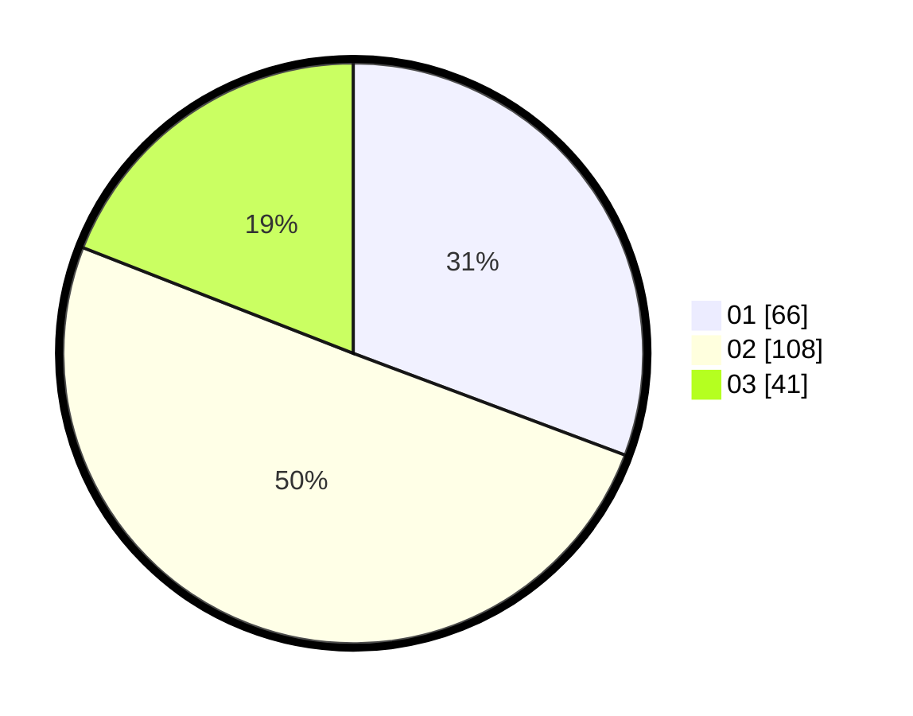

# Hasil

Hasil perolehan suara paslon dapat dilihat pada file paslon-01.txt, paslon-02.txt, dan paslon-03.txt.

Jika tidak ada, artinya data tersebut belum ada pada SIREKAP.

## Perolehan Suara

 * Paslon 01: **66**.
 * Paslon 02: **108**.
 * Paslon 03: **41**.

## Foto C Plano

https://sirekap-obj-formc.kpu.go.id/84c2/pemilu/ppwp/31/73/07/10/04/3173071004061-20240214-215323--197f39ea-a7c7-438d-a54a-7ad8658b9d52.jpg

https://sirekap-obj-formc.kpu.go.id/84c2/pemilu/ppwp/31/73/07/10/04/3173071004061-20240214-215431--049c8d9e-eb2a-4fde-b3ce-e10d01abeef7.jpg

https://sirekap-obj-formc.kpu.go.id/84c2/pemilu/ppwp/31/73/07/10/04/3173071004061-20240214-215505--5107d063-61d0-4ed2-af6f-da8dfb4c2ba5.jpg
