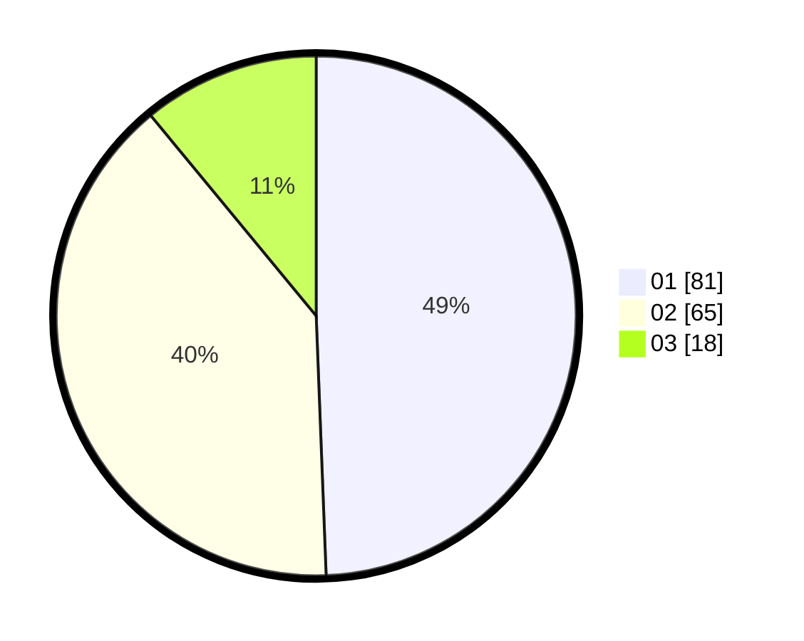

# Hasil

Hasil perolehan suara paslon dapat dilihat pada file paslon-01.txt, paslon-02.txt, dan paslon-03.txt.

Jika tidak ada, artinya data tersebut belum ada pada SIREKAP.

## Perolehan Suara

 * Paslon 01: **81**.
 * Paslon 02: **65**.
 * Paslon 03: **18**.

## Foto C Plano

https://sirekap-obj-formc.kpu.go.id/ebbb/pemilu/ppwp/31/73/07/10/04/3173071004075-20240214-230028--f33c0f87-3280-4827-89b4-5d7cd038758d.jpg

https://sirekap-obj-formc.kpu.go.id/ebbb/pemilu/ppwp/31/73/07/10/04/3173071004075-20240214-225904--065e03b1-1e9b-4fa2-9518-058047264710.jpg

https://sirekap-obj-formc.kpu.go.id/ebbb/pemilu/ppwp/31/73/07/10/04/3173071004075-20240214-225823--2379d00e-3b65-4cb6-9206-1bf4e73fadd0.jpg
