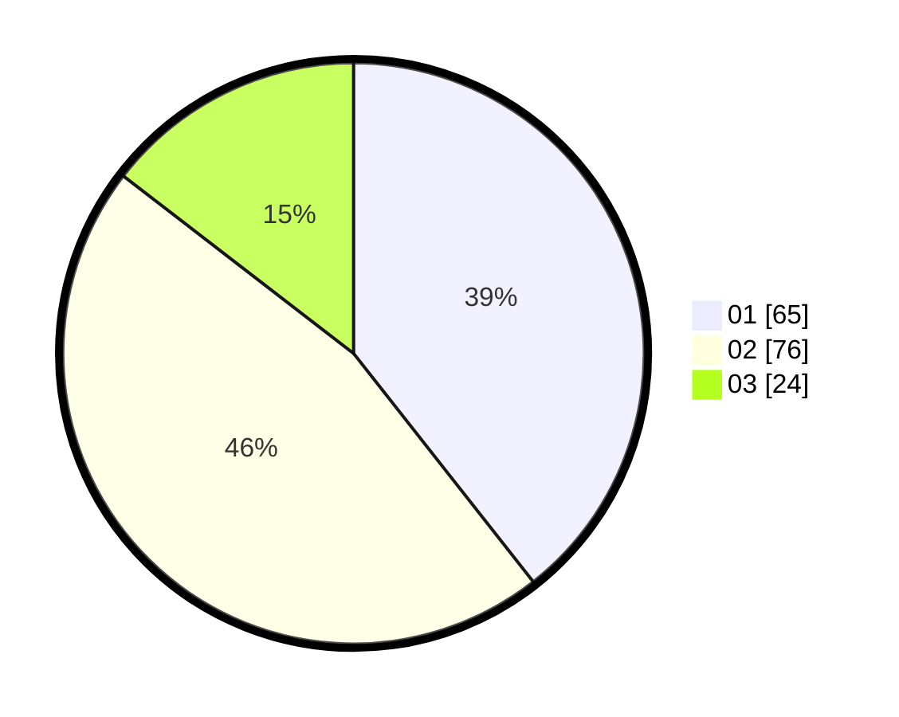

# Hasil

Hasil perolehan suara paslon dapat dilihat pada file paslon-01.txt, paslon-02.txt, dan paslon-03.txt.

Jika tidak ada, artinya data tersebut belum ada pada SIREKAP.

## Perolehan Suara

 * Paslon 01: **65**.
 * Paslon 02: **76**.
 * Paslon 03: **24**.

## Foto C Plano

https://sirekap-obj-formc.kpu.go.id/a045/pemilu/ppwp/31/73/07/10/04/3173071004077-20240216-204316--8bd5efc6-d7cf-4258-8d63-cbb876a9edd6.jpg

https://sirekap-obj-formc.kpu.go.id/a045/pemilu/ppwp/31/73/07/10/04/3173071004077-20240216-203241--b13d8b7b-6a2a-4584-8542-7a2204568aa7.jpg

https://sirekap-obj-formc.kpu.go.id/a045/pemilu/ppwp/31/73/07/10/04/3173071004077-20240216-203350--ab8e34d6-93aa-4443-b25b-e7fcc5f9f495.jpg

## DATA PEMILIH TETAP

Jumlah pemilih dalam DPT: **209**.
 * L: **103**.
 * P: **106**.

## DATA PENGGUNA HAK PILIH

Jumlah pengguna hak pilih dalam DPT: **167**.
 * L: **78**.
 * P: **89**.

Jumlah pengguna hak pilih dalam DPTb: **3**.
 * L: **2**.
 * P: **1**.

Jumlah pengguna hak pilih dalam DPK: **1**.
 * L: **1**.
 * P: **0**.

Jumlah pengguna hak pilih: **171**.
 * L: **81**.
 * P: **90**.

## JUMLAH SUARA SAH DAN TIDAK SAH

JUMLAH SELURUH SUARA SAH: **165**.

JUMLAH SUARA TIDAK SAH: **6**.

JUMLAH SELURUH SUARA SAH DAN SUARA TIDAK SAH: **171**.
