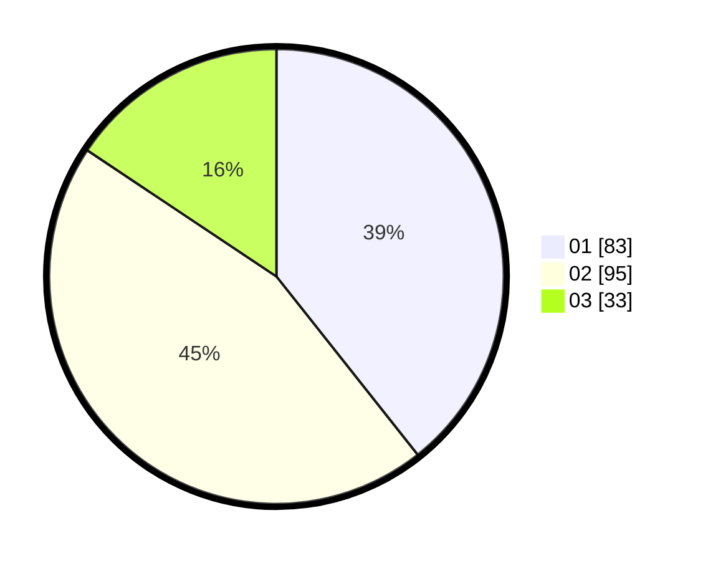

# Hasil

Hasil perolehan suara paslon dapat dilihat pada file paslon-01.txt, paslon-02.txt, dan paslon-03.txt.

Jika tidak ada, artinya data tersebut belum ada pada SIREKAP.

## Perolehan Suara

 * Paslon 01: **83**.
 * Paslon 02: **95**.
 * Paslon 03: **33**.

## Foto C Plano

https://sirekap-obj-formc.kpu.go.id/71a6/pemilu/ppwp/31/73/07/10/04/3173071004086-20240215-003846--e69f6bd7-cc74-43c5-b3d4-13ff9b617faa.jpg

https://sirekap-obj-formc.kpu.go.id/71a6/pemilu/ppwp/31/73/07/10/04/3173071004086-20240215-004004--1a0e5087-5c36-46c5-9d31-f92d9072c736.jpg

https://sirekap-obj-formc.kpu.go.id/71a6/pemilu/ppwp/31/73/07/10/04/3173071004086-20240215-004453--08901a53-c532-4d63-bb66-cbfae7127853.jpg
