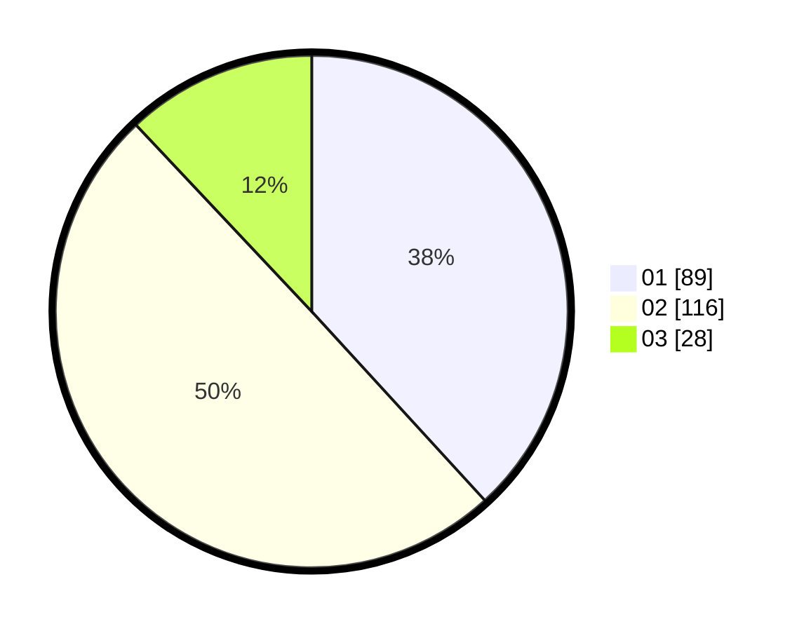

# Hasil

Hasil perolehan suara paslon dapat dilihat pada file paslon-01.txt, paslon-02.txt, dan paslon-03.txt.

Jika tidak ada, artinya data tersebut belum ada pada SIREKAP.

## Perolehan Suara

 * Paslon 01: **89**.
 * Paslon 02: **116**.
 * Paslon 03: **28**.

## Foto C Plano

https://sirekap-obj-formc.kpu.go.id/f352/pemilu/ppwp/31/73/07/10/04/3173071004089-20240214-184922--4bd1ec02-a524-4d1d-9cbd-820ad8b5272a.jpg

https://sirekap-obj-formc.kpu.go.id/f352/pemilu/ppwp/31/73/07/10/04/3173071004089-20240214-184537--d0cdeeed-f1e9-4e0a-8259-a6cd954b25d0.jpg

https://sirekap-obj-formc.kpu.go.id/f352/pemilu/ppwp/31/73/07/10/04/3173071004089-20240214-184806--a4b382bc-e257-41ab-9bc2-1f2c5e9a08d5.jpg

## DATA PEMILIH TETAP

Jumlah pemilih dalam DPT: **285**.
 * L: **158**.
 * P: **127**.

## DATA PENGGUNA HAK PILIH

Jumlah pengguna hak pilih dalam DPT: **232**.
 * L: **129**.
 * P: **103**.

Jumlah pengguna hak pilih dalam DPTb: **0**.
 * L: **0**.
 * P: **0**.

Jumlah pengguna hak pilih dalam DPK: **3**.
 * L: **1**.
 * P: **2**.

Jumlah pengguna hak pilih: **235**.
 * L: **130**.
 * P: **105**.

## JUMLAH SUARA SAH DAN TIDAK SAH

JUMLAH SELURUH SUARA SAH: **233**.

JUMLAH SUARA TIDAK SAH: **2**.

JUMLAH SELURUH SUARA SAH DAN SUARA TIDAK SAH: **235**.
