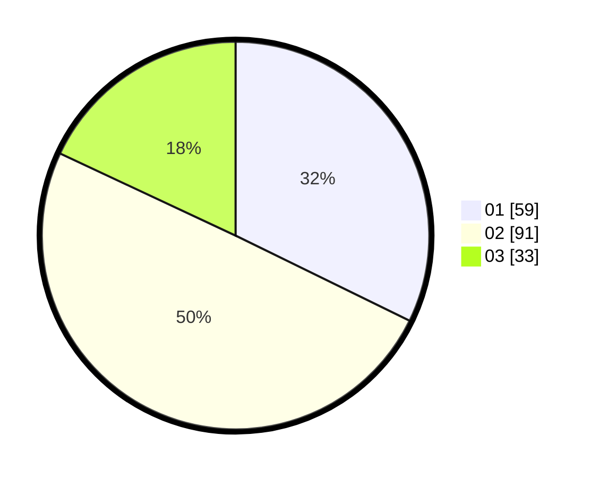

# Hasil

Hasil perolehan suara paslon dapat dilihat pada file paslon-01.txt, paslon-02.txt, dan paslon-03.txt.

Jika tidak ada, artinya data tersebut belum ada pada SIREKAP.

## Perolehan Suara

 * Paslon 01: **59**.
 * Paslon 02: **91**.
 * Paslon 03: **33**.

## Foto C Plano

https://sirekap-obj-formc.kpu.go.id/b154/pemilu/ppwp/31/73/07/10/04/3173071004091-20240214-224204--a5e39df9-7d5b-489a-9581-08e556e650a5.jpg

https://sirekap-obj-formc.kpu.go.id/b154/pemilu/ppwp/31/73/07/10/04/3173071004091-20240214-223512--e1a6bef9-d57a-43ab-abe5-42e716021d89.jpg

https://sirekap-obj-formc.kpu.go.id/b154/pemilu/ppwp/31/73/07/10/04/3173071004091-20240214-223733--cb56fd1e-4abd-44a7-988f-9815beb45463.jpg
