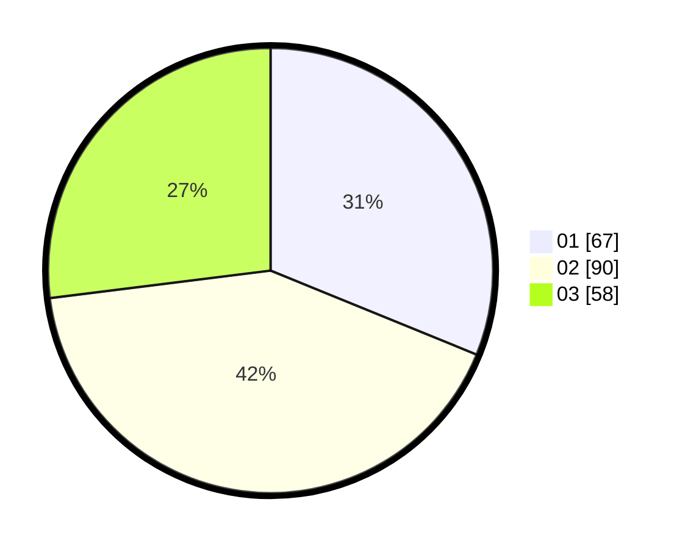

# Hasil

Hasil perolehan suara paslon dapat dilihat pada file paslon-01.txt, paslon-02.txt, dan paslon-03.txt.

Jika tidak ada, artinya data tersebut belum ada pada SIREKAP.

## Perolehan Suara

 * Paslon 01: **67**.
 * Paslon 02: **90**.
 * Paslon 03: **58**.

## Foto C Plano

https://sirekap-obj-formc.kpu.go.id/537d/pemilu/ppwp/31/73/07/10/05/3173071005002-20240215-204335--380c5dc6-04b2-4690-bd69-456fce7ee588.jpg

https://sirekap-obj-formc.kpu.go.id/537d/pemilu/ppwp/31/73/07/10/05/3173071005002-20240215-204436--71d8f8f7-3386-4b09-80cb-2cfa2e394eb3.jpg

https://sirekap-obj-formc.kpu.go.id/537d/pemilu/ppwp/31/73/07/10/05/3173071005002-20240215-204441--459a030d-e079-48cf-999b-ee08f5a3637a.jpg

## DATA PEMILIH TETAP

Jumlah pemilih dalam DPT: **280**.
 * L: **145**.
 * P: **135**.

## DATA PENGGUNA HAK PILIH

Jumlah pengguna hak pilih dalam DPT: **212**.
 * L: **109**.
 * P: **103**.

Jumlah pengguna hak pilih dalam DPTb: **2**.
 * L: **1**.
 * P: **1**.

Jumlah pengguna hak pilih dalam DPK: **4**.
 * L: **2**.
 * P: **2**.

Jumlah pengguna hak pilih: **218**.
 * L: **112**.
 * P: **106**.

## JUMLAH SUARA SAH DAN TIDAK SAH

JUMLAH SELURUH SUARA SAH: **215**.

JUMLAH SUARA TIDAK SAH: **3**.

JUMLAH SELURUH SUARA SAH DAN SUARA TIDAK SAH: **218**.
