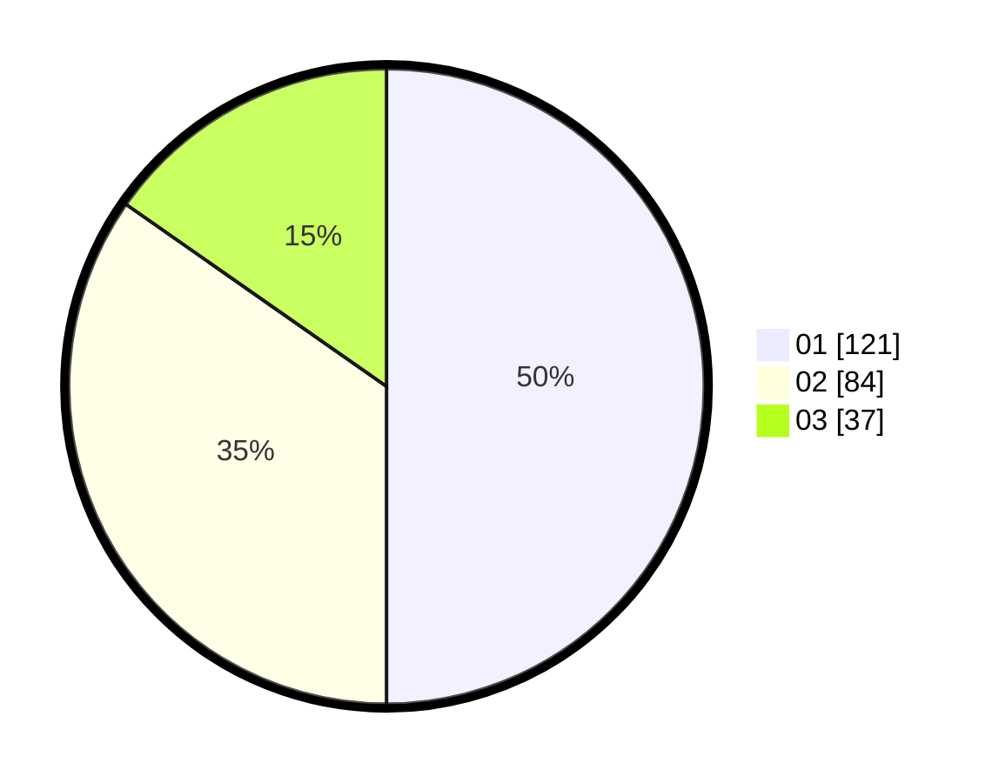

# Hasil

Hasil perolehan suara paslon dapat dilihat pada file paslon-01.txt, paslon-02.txt, dan paslon-03.txt.

Jika tidak ada, artinya data tersebut belum ada pada SIREKAP.

## Perolehan Suara

 * Paslon 01: **121**.
 * Paslon 02: **84**.
 * Paslon 03: **37**.

## Foto C Plano

https://sirekap-obj-formc.kpu.go.id/90ac/pemilu/ppwp/31/73/07/10/05/3173071005004-20240214-221454--f28a79f8-0c67-4ab4-9798-707e8a6aa18d.jpg

https://sirekap-obj-formc.kpu.go.id/90ac/pemilu/ppwp/31/73/07/10/05/3173071005004-20240214-221508--afab6ef8-3885-4cc5-b329-1b7e3fb439a8.jpg

https://sirekap-obj-formc.kpu.go.id/90ac/pemilu/ppwp/31/73/07/10/05/3173071005004-20240214-221522--deb727fa-2254-439b-b77b-8c998518cedc.jpg
